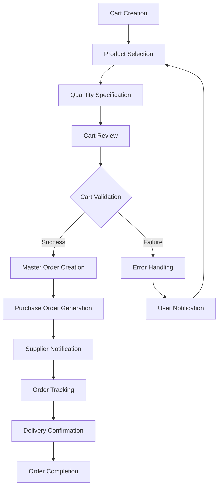
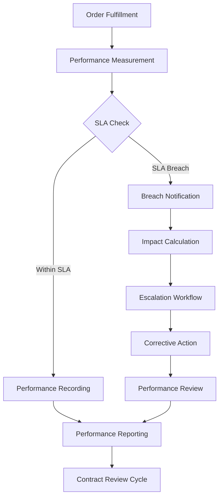
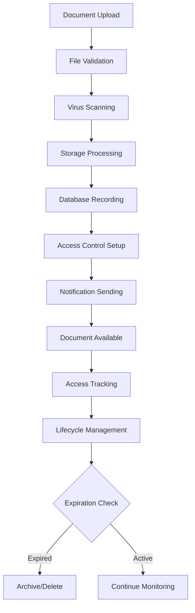

# Blue Whale Portal - Comprehensive Product & Architecture Dossier

This comprehensive dossier serves as the primary guidance document for Claude Code when working with the Blue Whale Portal system. It combines Product Requirements (PRD), Architecture Requirements (ARD), and Design specifications (DD) following enterprise standards and best practices.

## Document Management

- **Version**: 2.0
- **System**: Blue Whale Portal - B2B Supply Chain Management Platform
- **Created By**: Claude Code Analysis
- **Created Date**: 2024-08-10
- **Last Modified**: 2024-08-10
- **Architecture**: NestJS + Angular 18 + PostgreSQL + MinIO + Docker
- **Target Audience**: Development Team, System Architects, Product Managers
- **Classification**: Internal Development Documentation

---

# 1. Executive Summary

## 1.1 Project Vision

### Mission Statement
The Blue Whale Portal is a comprehensive B2B supply chain management platform designed to revolutionize how agricultural cooperatives procure, manage, and distribute packaging materials through a unified digital ecosystem that optimizes operations, reduces costs, and enhances transparency across the entire supply chain.

### Problem Statement
Agricultural cooperatives face significant challenges in packaging material procurement:
- **Fragmented Supplier Network**: Multiple suppliers with varying terms, pricing, and quality standards
- **Manual Processes**: Paper-based ordering, inventory tracking, and contract management
- **Lack of Visibility**: Limited insight into stock levels, order status, and supplier performance
- **Complex Negotiations**: Difficulty leveraging collective purchasing power across stations
- **Compliance Burden**: Manual tracking of certifications, quality standards, and regulatory requirements

### Solution Overview
Blue Whale Portal provides a modern, web-based platform that:
- **Centralizes Procurement**: Unified marketplace with pre-negotiated contracts and standardized processes
- **Automates Operations**: Digital workflows for ordering, inventory management, and document handling
- **Enhances Visibility**: Real-time dashboards, analytics, and performance monitoring
- **Optimizes Costs**: Volume-based pricing through master contracts and efficient distribution
- **Ensures Compliance**: Automated certification tracking and audit trail management

### Value Proposition
- **For Stations**: Simplified ordering, better pricing, reduced administrative overhead
- **For Suppliers**: Streamlined sales process, guaranteed volume, reduced payment risk
- **For Blue Whale**: New revenue streams, operational efficiency, market consolidation
- **For the Industry**: Digital transformation, standardization, improved sustainability

## 1.2 Business Context

### Market Opportunity
- **Market Size**: €2.5B+ European agricultural packaging market
- **Growth Rate**: 4-6% annual growth driven by sustainability and efficiency demands
- **Target Segments**: 15,000+ agricultural cooperatives across France and Europe
- **Digitization Gap**: <15% of cooperatives use integrated digital procurement systems

### Business Objectives
- **Revenue Growth**: Generate €50M+ annual GMV within 3 years
- **Market Penetration**: Onboard 500+ stations and 200+ suppliers by Year 2
- **Operational Excellence**: Achieve 99.5% system uptime and <2h average order processing
- **Cost Leadership**: Reduce procurement costs by 15-25% through volume aggregation

### Success Metrics
- **Platform GMV**: Gross Merchandise Value processed through the platform
- **User Adoption**: Monthly Active Users (stations, suppliers, Blue Whale staff)
- **Order Efficiency**: Time from cart to delivery confirmation
- **Cost Savings**: Percentage reduction in total cost of ownership
- **NPS Score**: Net Promoter Score from platform users

### Timeline
- **Phase 1** (Q4 2024): Core platform launch with 50 stations, 25 suppliers
- **Phase 2** (Q2 2025): Advanced features (contracts, analytics) with 200 stations
- **Phase 3** (Q4 2025): Multi-market expansion and API ecosystem

## 1.3 Scope & Constraints

### In Scope
- **Complete B2B Platform**: End-to-end procurement and fulfillment system
- **Multi-role Support**: Stations, Suppliers, Blue Whale operations, Platforms
- **Master Contract System**: Annual framework agreements with performance tracking
- **Shopping Cart Workflow**: Multi-supplier cart with automatic order grouping
- **Document Management**: Comprehensive document storage with access control
- **Real-time Analytics**: Business intelligence and performance dashboards
- **Email Integration**: Automated notifications and document delivery
- **Mobile-Responsive**: Full functionality across desktop, tablet, and mobile devices

### Out of Scope (This Release)
- **Mobile Native Apps**: iOS/Android applications (future roadmap)
- **ERP Integration**: Direct integration with station ERP systems (API-first for future)
- **Payment Processing**: Direct payment gateway integration (handled externally)
- **Warehouse Management**: Advanced WMS features for platforms
- **IoT Integration**: Sensor-based inventory tracking
- **Multi-currency**: International market support beyond EUR

### Constraints
- **Budget**: €2M development budget over 18 months
- **Timeline**: MVP launch within 12 months, full platform within 18 months
- **Compliance**: GDPR, French commercial law, agricultural regulations
- **Technology**: Open-source preferred, EU-based hosting requirements
- **Integration**: Must work with existing Blue Whale systems and processes

### Assumptions
- **User Adoption**: 70% of target stations will adopt digital procurement within 2 years
- **Supplier Participation**: 80% of existing suppliers will join the platform
- **Technology Reliability**: Cloud infrastructure provides 99.9% uptime
- **Market Stability**: Agricultural packaging market remains stable with continued growth

---

# 2. Business Requirements

## 2.1 Business Goals

### Primary Goals
1. **Digital Transformation**: Modernize agricultural packaging procurement through comprehensive digital platform
2. **Cost Optimization**: Reduce total procurement costs by 15-25% through volume aggregation and efficiency gains
3. **Revenue Generation**: Create new revenue streams for Blue Whale through platform fees and intermediary services
4. **Market Leadership**: Establish Blue Whale as the dominant digital platform for agricultural packaging in France

### Secondary Goals
1. **Operational Excellence**: Achieve industry-leading performance in order processing and customer service
2. **Sustainability**: Support environmental goals through optimized logistics and reduced waste
3. **Innovation**: Pioneer new business models and technologies in the agricultural supply chain
4. **Ecosystem Development**: Build a thriving ecosystem of stations, suppliers, and service providers

### Success Criteria
- **Financial**: €50M GMV, 15% net margin, 25% year-over-year growth
- **Operational**: 99.5% uptime, <4h order processing, 95% on-time delivery
- **Customer**: NPS >70, 90% user retention, 95% order accuracy
- **Market**: 30% market share in target segments, 500+ active stations

### ROI Expectations
- **Break-even**: Month 18 post-launch
- **Payback Period**: 24 months for initial investment
- **5-year ROI**: 400%+ return on initial development investment
- **Recurring Revenue**: 60%+ of revenue from recurring subscriptions and transaction fees

## 2.2 Stakeholder Analysis

### Primary Stakeholders
- **Blue Whale Management**: CEO, COO, CFO - strategic direction and ROI
- **Blue Whale Operations**: Operational teams managing daily platform activities
- **Product Owner**: Defines features, priorities, and user experience requirements
- **Development Team**: Architects, developers, designers responsible for platform delivery

### Secondary Stakeholders
- **Agricultural Stations**: End customers using the platform for procurement
- **Packaging Suppliers**: Vendors selling products through the platform
- **Platform Operators**: Warehouses and distribution centers providing fulfillment
- **Regulatory Bodies**: Ensuring compliance with agricultural and commercial regulations

### Stakeholder Needs
- **Management**: Clear ROI metrics, market growth, operational efficiency
- **Operations**: User-friendly tools, automated workflows, exception management
- **Stations**: Simple ordering, competitive pricing, reliable delivery
- **Suppliers**: Easy product management, order visibility, timely payments
- **Platforms**: Efficient fulfillment tools, capacity planning, performance metrics

### Communication Plan
- **Weekly**: Development team standups and progress updates
- **Bi-weekly**: Stakeholder demo sessions and feedback collection
- **Monthly**: Executive dashboard review and strategic alignment
- **Quarterly**: Business review and roadmap planning sessions

## 2.3 Business Rules

### Core Business Rules
1. **Master Contract Authority**: All pricing and terms derive from annually negotiated master contracts
2. **Order Hierarchy**: Shopping cart → Master Order → Multiple Purchase Orders (one per supplier)
3. **Role-based Access**: Strict permission system based on user role and organizational affiliation
4. **Audit Trail**: All changes must be tracked with user attribution and timestamps
5. **Financial Reconciliation**: All orders must have complete financial tracking for Blue Whale intermediary model

### Regulatory Requirements
- **GDPR Compliance**: Full data protection compliance including right to erasure
- **French Commercial Code**: Compliance with French B2B commerce regulations
- **Agricultural Standards**: Adherence to packaging standards for agricultural products
- **Financial Reporting**: Support for French accounting and tax reporting requirements

### Business Policies
- **Contract Negotiations**: Annual master contract negotiation cycle with suppliers
- **Pricing Transparency**: Clear cost breakdown showing supplier cost + Blue Whale margin
- **Payment Terms**: Net 30 for stations, supplier-specific terms for Blue Whale
- **Quality Standards**: Mandatory certification for all products and suppliers

### Industry Standards
- **ISO 22000**: Food safety management for packaging materials
- **BRC Standards**: Global food safety certification requirements
- **HACCP**: Hazard analysis and critical control points for food contact materials
- **Environmental**: Compliance with EU packaging and waste directives

---

# 3. User Research & Analysis

## 3.1 Target Audience

### Primary Users
1. **Station Procurement Managers** (500+ users)
   - Age: 35-55, rural locations, moderate technical proficiency
   - Responsible for packaging procurement decisions
   - Goal: Efficient ordering with competitive pricing

2. **Blue Whale Operations Staff** (50+ users)
   - Age: 25-45, office-based, high technical proficiency
   - Manage platform operations and customer support
   - Goal: Efficient platform management and issue resolution

3. **Supplier Catalog Managers** (200+ users)
   - Age: 30-50, mixed locations, moderate technical proficiency
   - Maintain product catalogs and pricing
   - Goal: Easy product management and order visibility

### Secondary Users
1. **Station General Managers**: Strategic oversight and budget approval
2. **Platform Operations Teams**: Fulfillment and logistics coordination
3. **Blue Whale Management**: Strategic monitoring and decision-making

### User Demographics
- **Geographic Distribution**: Primarily France (rural and urban)
- **Technical Skills**: Mixed proficiency, prefer intuitive interfaces
- **Device Usage**: Desktop primary (60%), tablet (25%), mobile (15%)
- **Time Constraints**: High workload, need efficient task completion

### User Psychographics
- **Motivations**: Cost savings, operational efficiency, regulatory compliance
- **Behaviors**: Routine-oriented, prefer familiar workflows
- **Preferences**: Clear information, minimal clicks, comprehensive feedback

## 3.2 User Personas

### Persona 1: Marie Dubois - Station Procurement Manager
- **Demographics**: 42 years old, Burgundy region, Agricultural Engineering degree
- **Role**: Procurement Manager at 150-member wine cooperative
- **Technical Skills**: Intermediate, comfortable with web applications
- **Goals**: 
  - Reduce packaging costs by 20%
  - Ensure consistent supply chain reliability
  - Minimize time spent on administrative tasks
- **Pain Points**:
  - Managing relationships with multiple suppliers
  - Comparing pricing across different packaging options
  - Tracking order status and delivery schedules
- **Behaviors**:
  - Plans purchases seasonally based on harvest forecasts
  - Values supplier reliability over lowest price
  - Prefers email communication with detailed confirmations
- **Technology Usage**: Desktop computer, occasional tablet, smartphone for notifications
- **Quote**: "I need a system that saves me time and gives me confidence that our packaging will arrive when we need it."

### Persona 2: Thomas Martin - Blue Whale Operations Specialist
- **Demographics**: 29 years old, Lyon office, Business Administration degree
- **Role**: Customer Success Manager overseeing 100+ station relationships
- **Technical Skills**: Advanced, power user of business applications
- **Goals**:
  - Maintain 98%+ customer satisfaction ratings
  - Resolve issues quickly and proactively
  - Identify opportunities for account growth
- **Pain Points**:
  - Managing high volume of customer inquiries
  - Tracking complex multi-supplier orders
  - Generating reports for management review
- **Behaviors**:
  - Monitors platform activity throughout the day
  - Proactively reaches out to customers with issues
  - Uses analytics to identify trends and opportunities
- **Technology Usage**: Desktop workstation, dual monitors, mobile for urgent alerts
- **Quote**: "I need real-time visibility into everything happening on the platform so I can help our customers succeed."

### Persona 3: Sophie Leroux - Supplier Product Manager
- **Demographics**: 38 years old, Industrial region, Packaging Engineering background
- **Role**: Product Manager at mid-size packaging supplier (500+ SKUs)
- **Technical Skills**: Intermediate, experienced with B2B platforms
- **Goals**:
  - Increase sales volume through Blue Whale channel
  - Maintain accurate product information and pricing
  - Respond quickly to customer inquiries
- **Pain Points**:
  - Keeping product specifications current across channels
  - Understanding which products perform best
  - Managing pricing updates across large catalog
- **Behaviors**:
  - Updates product information weekly
  - Monitors order patterns to forecast demand
  - Collaborates closely with sales team on pricing
- **Technology Usage**: Desktop for detailed work, tablet for field visits, mobile for alerts
- **Quote**: "I want to showcase our products effectively and make it easy for customers to find what they need."

## 3.3 User Journey Mapping

### Current State Journey: Station Procurement Process
1. **Need Recognition** (Week 1-2)
   - Station identifies packaging needs based on upcoming harvest
   - Reviews historical consumption patterns
   - **Pain Point**: Manual calculation of requirements

2. **Information Gathering** (Week 3-4)
   - Contacts multiple suppliers for quotes
   - Compares pricing and specifications manually
   - **Pain Point**: Time-consuming back-and-forth communication

3. **Supplier Selection** (Week 5-6)
   - Evaluates quotes considering price, quality, delivery terms
   - Negotiates terms individually with each supplier
   - **Pain Point**: Limited leverage for individual stations

4. **Order Placement** (Week 7)
   - Places orders via phone, email, or supplier websites
   - Tracks orders manually through various systems
   - **Pain Point**: No unified view of order status

5. **Delivery & Receipt** (Week 8-12)
   - Coordinates deliveries from multiple suppliers
   - Manually verifies deliveries against orders
   - **Pain Point**: Complex logistics coordination

### Future State Journey: Blue Whale Portal Process
1. **Need Recognition** (Week 1)
   - Platform suggests quantities based on historical data
   - Demand forecasting tools provide recommendations
   - **Improvement**: Data-driven planning

2. **Product Selection** (Week 1)
   - Browse unified catalog with pre-negotiated pricing
   - Compare options with built-in decision support tools
   - **Improvement**: Single source, optimized pricing

3. **Order Creation** (Week 1)
   - Build cart with products from multiple suppliers
   - System automatically groups by supplier for optimal fulfillment
   - **Improvement**: Simplified multi-supplier ordering

4. **Order Processing** (Week 1-2)
   - Automated order routing to suppliers
   - Real-time status updates and delivery tracking
   - **Improvement**: Automated processing and visibility

5. **Delivery & Receipt** (Week 2-4)
   - Coordinated delivery schedule from platform
   - Digital receipt confirmation and quality tracking
   - **Improvement**: Unified logistics and quality management

## 3.4 Use Cases and Scenarios

### Primary Use Cases

#### UC-001: Multi-Supplier Shopping Cart
**Actor**: Station Procurement Manager
**Goal**: Purchase packaging materials from multiple suppliers in a single transaction
**Scenario**:
1. User logs into platform and navigates to product catalog
2. Searches for specific product types (e.g., "wine bottle labels")
3. Compares options from multiple suppliers with pricing and specifications
4. Adds products to cart from different suppliers
5. Reviews cart and sees automatic grouping by supplier
6. Validates cart, creating Master Order with multiple Purchase Orders
7. Receives confirmation email with order details and expected delivery

**Success Criteria**: Order successfully created with proper supplier grouping and pricing

#### UC-002: Contract Performance Monitoring
**Actor**: Blue Whale Operations Manager
**Goal**: Monitor supplier performance against contract SLAs
**Scenario**:
1. User accesses contract performance dashboard
2. Reviews real-time metrics for delivery, quality, and response times
3. Identifies suppliers with declining performance or SLA breaches
4. Drills down into specific performance issues and root causes
5. Initiates corrective action workflows with underperforming suppliers
6. Generates performance reports for management review

**Success Criteria**: Clear visibility into performance with actionable insights

### Secondary Use Cases

#### UC-003: Document Management
**Actor**: Quality Manager
**Goal**: Maintain product certifications and compliance documentation
**Scenario**:
1. User uploads product certification documents to platform
2. Associates documents with specific product-supplier combinations
3. Sets expiration dates and renewal reminders
4. Grants access permissions to relevant stakeholders
5. System automatically alerts when certificates near expiration
6. Generates compliance reports for audits

**Success Criteria**: Complete document lifecycle management with audit trail

### Error Scenarios

#### ES-001: Order Processing Failure
**Scenario**: System failure during order validation process
**Recovery**: 
1. System preserves cart state and notifies user of temporary issue
2. Automatic retry mechanism attempts reprocessing
3. If failure persists, incident escalated to operations team
4. User receives notification with estimated resolution time
5. Order processed once system restored, with priority handling

#### ES-002: Supplier Unavailability
**Scenario**: Selected supplier cannot fulfill order quantities
**Recovery**:
1. System identifies alternative suppliers with same products
2. Presents alternatives with pricing and delivery comparison
3. Allows user to modify order with substitute suppliers
4. Updates Master Order to reflect changes
5. Maintains audit trail of substitutions for compliance

---

# 4. User Roles & Access Control

## 4.1 Role Definitions

### ADMIN Role
- **Description**: System administrators with full platform access
- **Responsibilities**:
  - System configuration and maintenance
  - User management across all organizations
  - Platform-wide analytics and reporting
  - Technical support and troubleshooting
- **Authority Level**: Full system access, can override all restrictions
- **Reporting Structure**: Reports to Blue Whale CTO, manages technical team

### MANAGER Role  
- **Description**: Business managers overseeing platform operations
- **Responsibilities**:
  - Business process management and optimization
  - Cross-organizational relationship management
  - Performance monitoring and strategic planning
  - Budget oversight and financial reporting
- **Authority Level**: Business operations access, limited technical administration
- **Reporting Structure**: Reports to Blue Whale COO, manages operations team

### HANDLER Role (Blue Whale Operations)
- **Description**: Blue Whale operational staff managing day-to-day platform activities
- **Responsibilities**:
  - Customer support and issue resolution
  - Order processing and exception handling  
  - Supplier relationship management
  - Data entry and maintenance
- **Authority Level**: Operational access within assigned scope
- **Reporting Structure**: Reports to Operations Manager, front-line support

### STATION Role
- **Description**: Agricultural cooperative staff managing procurement activities
- **Responsibilities**:
  - Product browsing and order placement
  - Inventory management and forecasting
  - Receipt confirmation and quality feedback
  - Local compliance and documentation
- **Authority Level**: Limited to station-specific data and operations
- **Reporting Structure**: Station employees, various internal reporting

### SUPPLIER Role
- **Description**: Packaging supplier staff managing catalog and orders
- **Responsibilities**:
  - Product catalog management and pricing
  - Order fulfillment and shipping
  - Document management (certifications, specs)
  - Customer communication and support
- **Authority Level**: Limited to supplier-specific data and assigned customers
- **Reporting Structure**: Supplier employees, various internal reporting

## 4.2 Permission Matrix

### Data Access Permissions

| Resource | ADMIN | MANAGER | HANDLER | STATION | SUPPLIER |
|----------|-------|---------|---------|---------|----------|
| **Users** |
| View All | ✓ | ✓ | ✓ | - | - |
| View Own Org | ✓ | ✓ | ✓ | ✓ | ✓ |
| Create/Edit | ✓ | ✓ | ✓* | - | - |
| Delete | ✓ | ✓ | - | - | - |
| **Orders** |
| View All | ✓ | ✓ | ✓ | - | - |
| View Own | ✓ | ✓ | ✓ | ✓ | ✓ |
| Create | ✓ | ✓ | ✓ | ✓ | - |
| Modify Status | ✓ | ✓ | ✓ | - | ✓* |
| **Products** |
| View All | ✓ | ✓ | ✓ | ✓ | ✓* |
| Create/Edit | ✓ | ✓ | ✓ | - | ✓* |
| Delete | ✓ | ✓ | - | - | - |
| **Analytics** |
| Global Reports | ✓ | ✓ | - | - | - |
| Operational Reports | ✓ | ✓ | ✓ | - | - |
| Own Performance | ✓ | ✓ | ✓ | ✓ | ✓ |

*Limited to specific scope or conditions

### Feature Access Permissions

| Feature | ADMIN | MANAGER | HANDLER | STATION | SUPPLIER |
|---------|-------|---------|---------|---------|----------|
| **Platform Management** |
| System Config | ✓ | - | - | - | - |
| User Management | ✓ | ✓ | ✓* | - | - |
| Contract Management | ✓ | ✓ | ✓ | - | - |
| **Procurement** |
| Shopping Cart | ✓ | ✓ | ✓ | ✓ | - |
| Order Management | ✓ | ✓ | ✓ | ✓* | ✓* |
| Supplier Selection | ✓ | ✓ | ✓ | ✓ | - |
| **Operations** |
| Inventory Management | ✓ | ✓ | ✓ | ✓* | ✓* |
| Document Management | ✓ | ✓ | ✓ | ✓* | ✓* |
| Quality Management | ✓ | ✓ | ✓ | ✓* | ✓* |
| **Analytics** |
| Business Intelligence | ✓ | ✓ | - | - | - |
| Performance Dashboards | ✓ | ✓ | ✓ | ✓* | ✓* |
| Financial Reporting | ✓ | ✓ | - | - | - |

*Limited to organization-specific data

### Administrative Rights

| Administrative Function | ADMIN | MANAGER | HANDLER | STATION | SUPPLIER |
|------------------------|-------|---------|---------|---------|----------|
| Create Organizations | ✓ | - | - | - | - |
| Modify System Settings | ✓ | - | - | - | - |
| Access Logs | ✓ | ✓ | - | - | - |
| Backup/Restore | ✓ | - | - | - | - |
| API Management | ✓ | ✓* | - | - | - |
| Integration Management | ✓ | ✓ | - | - | - |

## 4.3 Authentication & Authorization

### Authentication Methods
1. **Primary Authentication**: Username/password with bcrypt hashing
2. **Session Management**: JWT tokens with configurable expiration (8 hours default)
3. **Token Refresh**: Automatic token refresh for active sessions
4. **Password Requirements**: Minimum 8 characters, mixed case, numbers, special characters

### Password Policies
- **Complexity**: Strong password requirements with entropy validation
- **Expiration**: 90-day expiration for administrative accounts
- **History**: Prevent reuse of last 6 passwords
- **Lockout**: Account lockout after 5 failed attempts (30-minute duration)
- **Recovery**: Secure password reset via email with time-limited tokens

### Session Management
- **Token Expiration**: 8-hour sliding window for active users
- **Concurrent Sessions**: Maximum 3 concurrent sessions per user
- **Session Tracking**: Complete session audit logs with IP and device info
- **Logout**: Secure logout with token invalidation

### Multi-Factor Authentication (Future Enhancement)
- **TOTP Support**: Time-based one-time passwords for sensitive accounts
- **SMS Backup**: SMS-based backup codes for MFA recovery
- **Selective Enforcement**: MFA required for ADMIN and MANAGER roles

### Role Inheritance and Assignment
- **Role Assignment**: Single role per user with organization context
- **Permission Inheritance**: Hierarchical permission model
- **Dynamic Permissions**: Context-sensitive permissions based on data ownership
- **Role Switching**: No role switching within sessions for audit clarity

---

# 5. Functional Requirements

## 5.1 Feature Prioritization (MoSCoW)

### Must Have (M) - Critical for MVP Launch
1. **User Management System**
   - Multi-role authentication and authorization
   - Organization-based access control
   - Profile management and password reset

2. **Product Catalog Management**
   - Multi-supplier product catalog
   - Product specifications and documentation
   - Pricing management with master contract integration

3. **Shopping Cart & Order Management**
   - Multi-supplier shopping cart functionality
   - Master Order creation with automatic supplier grouping
   - Purchase Order generation and tracking

4. **Basic Inventory Management**
   - Multi-location stock tracking
   - Basic stock movements and adjustments
   - Reserved quantity management

5. **Document Management**
   - Product image management
   - Basic certification document storage
   - Order document generation (PDFs)

### Should Have (S) - Important for Complete Platform
1. **Advanced Order Processing**
   - Sales Order management for Blue Whale sales
   - Order status workflow automation
   - Delivery tracking and confirmation

2. **Contract Management System**
   - Master contract framework
   - Product-specific SLA management
   - Performance tracking and reporting

3. **Advanced Analytics**
   - Executive dashboards
   - Performance metrics and KPIs
   - Business intelligence reporting

4. **Email Integration**
   - Automated order confirmations
   - Status update notifications
   - Document delivery via email

5. **Transfer Management**
   - Inter-station stock transfers
   - Transfer approval workflows
   - Transfer tracking and reporting

### Could Have (C) - Nice-to-Have Enhancements
1. **Advanced Document Management**
   - Comprehensive access control
   - Document versioning
   - Advanced search capabilities

2. **Quality Management**
   - Discrepancy photo documentation
   - Quality issue tracking
   - Root cause analysis tools

3. **Advanced Reporting**
   - Custom report builder
   - Scheduled report delivery
   - Data export capabilities

4. **Mobile Optimization**
   - Progressive Web App features
   - Offline capabilities
   - Mobile-specific UI patterns

5. **API Ecosystem**
   - Public API endpoints
   - Webhook integrations
   - Third-party system connectors

### Won't Have (W) - Explicitly Excluded from This Release
1. **Native Mobile Applications** - iOS/Android apps (future roadmap)
2. **Real-time Payment Processing** - Payment gateway integration
3. **Advanced Warehouse Management** - WMS features for platforms
4. **Multi-currency Support** - International market support
5. **ERP Integration** - Direct ERP system integration
6. **IoT Integration** - Sensor-based inventory tracking

## 5.2 Epic and Feature Breakdown

### Epic 1: User Management & Authentication
**Epic Description**: Complete user management system with role-based access control
**Business Value**: Foundation for secure, multi-tenant platform operations
**Dependencies**: None (foundational epic)

#### Features:
1. **User Registration & Authentication**
   - User registration with email verification
   - Secure login with JWT token management
   - Password reset functionality
   - Session management with timeout

2. **Role-Based Access Control**
   - Five-tier role system (Admin, Manager, Handler, Station, Supplier)
   - Organization-based access permissions
   - Dynamic permission checking
   - Role assignment and management

3. **Profile Management**
   - User profile editing and maintenance
   - Organization affiliation management
   - Preference settings
   - Activity history tracking

### Epic 2: Product Catalog & Supplier Management
**Epic Description**: Comprehensive product catalog with multi-supplier support
**Business Value**: Enables centralized product discovery with competitive pricing
**Dependencies**: User Management System

#### Features:
1. **Product Catalog**
   - Multi-category product organization
   - Product specifications and documentation
   - Image management and display
   - Search and filtering capabilities

2. **Supplier Management**
   - Supplier onboarding and profile management
   - Product-supplier relationship management
   - Pricing and availability management
   - Supplier performance tracking

3. **Master Contract Integration**
   - Contract-based pricing display
   - SLA integration for delivery terms
   - Performance metric integration
   - Compliance requirement tracking

### Epic 3: Shopping Cart & Order Management
**Epic Description**: Multi-supplier shopping cart with automated order processing
**Business Value**: Streamlines procurement process and reduces administrative overhead
**Dependencies**: Product Catalog, User Management

#### Features:
1. **Shopping Cart Management**
   - Multi-supplier cart functionality
   - Product comparison tools
   - Quantity and pricing calculation
   - Save and share cart functionality

2. **Order Processing**
   - Master Order creation from cart validation
   - Automatic Purchase Order generation by supplier
   - Order routing and notification system
   - Status tracking and updates

3. **Order Fulfillment**
   - Delivery address management
   - Shipping method selection
   - Tracking integration
   - Receipt confirmation

### Epic 4: Inventory & Stock Management
**Epic Description**: Multi-location inventory tracking and management
**Business Value**: Provides visibility and control over stock across all locations
**Dependencies**: Product Catalog, User Management

#### Features:
1. **Stock Tracking**
   - Multi-location inventory visibility
   - Real-time stock level updates
   - Reserved quantity management
   - Low stock alerting

2. **Stock Movements**
   - Inventory adjustment capabilities
   - Movement history and audit trail
   - Batch and serial number tracking
   - Cycle counting support

3. **Transfer Management**
   - Inter-station transfer requests
   - Transfer approval workflows
   - Transfer tracking and confirmation
   - Transfer cost allocation

### Epic 5: Document Management System
**Epic Description**: Comprehensive document storage and management with access control
**Business Value**: Centralizes all business documents with security and compliance
**Dependencies**: User Management, Product Catalog

#### Features:
1. **Document Storage**
   - Multi-bucket storage organization
   - File type validation and security
   - Version control and history
   - Bulk upload capabilities

2. **Access Control**
   - Role-based document permissions
   - Time-limited access grants
   - IP-based access restrictions
   - Audit trail for all access

3. **Document Generation**
   - Automated order document creation
   - Template-based PDF generation
   - Email integration for delivery
   - Custom report generation

## 5.3 User Stories (Agile Format)

### User Management Stories

#### Story UM-001: User Login
**As a** platform user  
**I want** to log in securely with my credentials  
**So that** I can access my authorized platform features  

**Acceptance Criteria**:
- User can enter username/email and password
- System validates credentials against database
- Successful login redirects to appropriate dashboard
- Failed login shows clear error message
- Account lockout after 5 failed attempts

**Definition of Done**:
- Login form validates input fields
- JWT token generated and stored securely
- Appropriate dashboard loaded based on user role
- Security logging implemented
- Responsive design works on all devices

**Story Points**: 5  
**Dependencies**: Database setup, JWT configuration

#### Story UM-002: Role-Based Navigation
**As a** platform user  
**I want** to see only the navigation options relevant to my role  
**So that** I can efficiently access the features I'm authorized to use  

**Acceptance Criteria**:
- Navigation menu reflects user's role permissions
- Unauthorized options are not displayed
- Role changes immediately update navigation
- Consistent navigation across all pages
- Clear indication of current page/section

**Definition of Done**:
- Dynamic navigation component implemented
- Permission checking integrated
- Navigation strategy pattern implemented
- All roles tested and validated
- Accessibility compliance verified

**Story Points**: 8  
**Dependencies**: User authentication, role system

### Product Management Stories

#### Story PM-001: Browse Product Catalog
**As a** Station Procurement Manager  
**I want** to browse products from multiple suppliers in one catalog  
**So that** I can compare options and make informed purchasing decisions  

**Acceptance Criteria**:
- Product catalog displays items from all suppliers
- Each product shows supplier, pricing, and specifications
- Search and filtering options available
- Product images and descriptions visible
- Supplier comparison view available

**Definition of Done**:
- Product catalog component implemented
- Search and filter functionality working
- Product detail pages complete
- Image loading optimized
- Mobile-responsive design

**Story Points**: 13  
**Dependencies**: Product data model, supplier management

#### Story PM-002: Add Products to Cart
**As a** Station Procurement Manager  
**I want** to add products from multiple suppliers to my cart  
**So that** I can purchase everything I need in one transaction  

**Acceptance Criteria**:
- Products can be added to cart from catalog
- Cart displays items grouped by supplier
- Quantities can be adjusted in cart
- Cart totals calculated correctly by supplier
- Cart persists across browser sessions

**Definition of Done**:
- Shopping cart service implemented
- Cart component with supplier grouping
- Quantity validation and limits
- Cart persistence (localStorage/database)
- Real-time price calculations

**Story Points**: 8  
**Dependencies**: Product catalog, pricing system

### Order Management Stories

#### Story OM-001: Create Order from Cart
**As a** Station Procurement Manager  
**I want** to convert my shopping cart into orders  
**So that** I can formally place my purchase request with multiple suppliers  

**Acceptance Criteria**:
- Cart validation creates Master Order
- Separate Purchase Orders generated per supplier
- Order confirmation displays all details
- Email confirmation sent to user
- Order numbers assigned and tracked

**Definition of Done**:
- Master Order creation logic implemented
- Purchase Order generation by supplier
- Order confirmation page and email
- Order numbering system
- Database relationships established

**Story Points**: 21  
**Dependencies**: Shopping cart, email system

### Contract Management Stories

#### Story CM-001: View Contract Performance
**As a** Blue Whale Manager  
**I want** to see how suppliers are performing against their contracts  
**So that** I can identify issues and take corrective action  

**Acceptance Criteria**:
- Dashboard shows key performance metrics
- Supplier performance ranked and compared
- SLA breach alerts clearly displayed
- Drill-down capability for detailed analysis
- Export capability for reports

**Definition of Done**:
- Performance dashboard implemented
- Real-time metric calculations
- Alert system for SLA breaches
- Detailed performance drill-down
- Report export functionality

**Story Points**: 21  
**Dependencies**: Contract system, order tracking

## 5.4 Behavior-Driven Development (BDD) Scenarios

### Scenario: Multi-Supplier Order Creation
```gherkin
Feature: Multi-Supplier Order Processing
  As a Station Procurement Manager
  I want to create orders with products from multiple suppliers
  So that I can procure all my needs efficiently

Scenario: Create order with products from three suppliers
  Given I am logged in as a Station Procurement Manager
  And I have products from 3 different suppliers in my cart
  And all products are available and properly priced
  When I validate my shopping cart
  Then a Master Order should be created with my details
  And 3 separate Purchase Orders should be generated
  And each Purchase Order should contain only products from its respective supplier
  And I should receive an email confirmation with all order details
  And each supplier should be notified of their respective Purchase Order

Scenario: Handle unavailable product during order creation
  Given I am logged in as a Station Procurement Manager
  And I have products from 2 suppliers in my cart
  And one product becomes unavailable after adding to cart
  When I validate my shopping cart
  Then I should be notified of the unavailable product
  And I should be presented with alternative suppliers for that product
  And I can choose to substitute or remove the unavailable item
  And the order creation should continue with my updated selections
```

### Scenario: Contract Performance Monitoring
```gherkin
Feature: Contract Performance Tracking
  As a Blue Whale Manager
  I want to monitor supplier performance against contracts
  So that I can ensure service levels and take corrective action

Scenario: Identify SLA breach and escalate
  Given I am logged in as a Blue Whale Manager
  And supplier "PackCorp" has a delivery SLA of 5 business days
  And there is an order from "PackCorp" that is 7 days overdue
  When I view the contract performance dashboard
  Then "PackCorp" should be flagged with an SLA breach
  And the breach should be categorized as "Delivery Delay"
  And the financial impact should be calculated automatically
  And I should see options to escalate or contact the supplier
  And an alert should be sent to the operations team

Scenario: View supplier performance trends
  Given I am logged in as a Blue Whale Manager  
  And I want to review quarterly supplier performance
  When I access the supplier performance report
  Then I should see performance metrics for all active suppliers
  And metrics should include delivery time, quality, and responsiveness
  And I should see trend lines showing performance over time
  And I can filter by supplier, product category, or time period
  And I can export the data for further analysis
```

## 5.5 Workflow Definitions

### Order Processing Workflow



### Contract Performance Workflow



### Document Management Workflow



---

# 6. Data Requirements

## 6.1 Data Model Overview

### Core Entities
The Blue Whale Portal manages eight primary business entities with complex inter-relationships:

1. **User**: Platform users with role-based access across organizations
2. **Organization**: Platforms, Stations, and Suppliers as distinct business entities  
3. **Product**: Packaging materials catalog with specifications and categories
4. **Order**: Master Orders containing multiple Purchase/Sales Orders
5. **Stock**: Multi-location inventory tracking with movement history
6. **Contract**: Master contracts with SLA management and performance tracking
7. **Document**: Comprehensive document management with access control
8. **Transfer**: Inter-station stock movement requests and approvals

### Entity Relationships
- **User → Organization**: Many-to-one with role context (polymorphic via entityType/entityId)
- **Product ↔ Supplier**: Many-to-many via ProductSupplier junction with pricing
- **MasterOrder → PurchaseOrder**: One-to-many parent-child hierarchy  
- **PurchaseOrder ↔ SalesOrder**: One-to-one linking when applicable
- **Product → Stock**: One-to-many across multiple locations (Station/Platform/Supplier)
- **Contract → Product**: One-to-many with product-specific SLA overrides
- **Document → Entity**: Polymorphic association with any business entity

### Data Flow
1. **Catalog Management**: Suppliers maintain products → ProductSupplier relationships → Pricing
2. **Order Processing**: Cart → MasterOrder → PurchaseOrders → Supplier fulfillment
3. **Stock Management**: Movements → Stock adjustments → Availability calculation
4. **Contract Tracking**: Orders → Performance measurement → SLA validation → Reporting

### Data Sources
- **User Input**: Manual data entry through web interface forms
- **System Generated**: Automated order numbers, timestamps, calculations
- **File Uploads**: Product images, certification documents, quality photos
- **External Integration**: Email notifications, document generation, performance metrics

## 6.2 Data Specifications

### User Entity
**Table**: `users`
**Description**: Platform users with role-based access and organization affiliation

| Attribute | Data Type | Constraints | Description |
|-----------|-----------|-------------|-------------|
| id | UUID | PRIMARY KEY | Unique user identifier |
| firstName | VARCHAR(100) | NOT NULL | User's first name |
| lastName | VARCHAR(100) | NOT NULL | User's last name |
| email | VARCHAR(255) | NOT NULL, UNIQUE | Email address (login credential) |
| password | VARCHAR(255) | NOT NULL | bcrypt hashed password |
| role | ENUM | NOT NULL | ADMIN, MANAGER, HANDLER, STATION, SUPPLIER |
| entityType | VARCHAR(50) | NOT NULL | Organization type (Platform, Station, Supplier) |
| entityId | UUID | NOT NULL | Foreign key to organization |
| isActive | BOOLEAN | DEFAULT true | Soft delete flag |
| lastLoginAt | TIMESTAMP | NULLABLE | Last successful login timestamp |
| createdAt | TIMESTAMP | NOT NULL | Record creation timestamp |
| updatedAt | TIMESTAMP | NOT NULL | Last modification timestamp |

**Relationships**:
- Polymorphic relationship to Platform, Station, or Supplier via (entityType, entityId)
- One-to-many with EntityHistory for audit trail

### Product Entity
**Table**: `products`
**Description**: Packaging materials catalog with specifications and categories

| Attribute | Data Type | Constraints | Description |
|-----------|-----------|-------------|-------------|
| id | UUID | PRIMARY KEY | Unique product identifier |
| name | VARCHAR(200) | NOT NULL | Product name/title |
| description | TEXT | NULLABLE | Detailed product description |
| category | ENUM | NOT NULL | Product category from predefined list |
| conditioningUnit | ENUM | NOT NULL | Packaging unit (PIECE, KG, M2, etc.) |
| specifications | JSON | NULLABLE | Technical specifications object |
| isActive | BOOLEAN | DEFAULT true | Product availability status |
| createdAt | TIMESTAMP | NOT NULL | Record creation timestamp |
| updatedAt | TIMESTAMP | NOT NULL | Last modification timestamp |

**Relationships**:
- Many-to-many with Supplier via ProductSupplier
- One-to-many with Stock across multiple locations
- One-to-many with OrderProduct for order line items

### ProductSupplier Junction Entity
**Table**: `product_suppliers`
**Description**: Product-supplier relationships with pricing and availability

| Attribute | Data Type | Constraints | Description |
|-----------|-----------|-------------|-------------|
| id | UUID | PRIMARY KEY | Unique relationship identifier |
| productId | UUID | NOT NULL, FK | Reference to Product |
| supplierId | UUID | NOT NULL, FK | Reference to Supplier |
| supplierReference | VARCHAR(100) | NULLABLE | Supplier's product code |
| unitPrice | DECIMAL(10,2) | NOT NULL | Price per conditioning unit |
| minimumQuantity | INTEGER | DEFAULT 1 | Minimum order quantity |
| leadTimeDays | INTEGER | DEFAULT 7 | Standard delivery lead time |
| isActive | BOOLEAN | DEFAULT true | Relationship status |
| createdAt | TIMESTAMP | NOT NULL | Record creation timestamp |
| updatedAt | TIMESTAMP | NOT NULL | Last modification timestamp |

### MasterOrder Entity
**Table**: `master_orders`
**Description**: Umbrella orders grouping multiple supplier orders for unified tracking

| Attribute | Data Type | Constraints | Description |
|-----------|-----------|-------------|-------------|
| id | UUID | PRIMARY KEY | Unique master order identifier |
| orderNumber | VARCHAR(20) | NOT NULL, UNIQUE | Human-readable order number |
| stationId | UUID | NOT NULL, FK | Ordering station reference |
| totalAmount | DECIMAL(12,2) | NOT NULL | Total order value across all suppliers |
| currency | VARCHAR(3) | DEFAULT 'EUR' | Currency code |
| status | ENUM | NOT NULL | Order status workflow |
| deliveryAddress | JSON | NOT NULL | Delivery location details |
| notes | TEXT | NULLABLE | Additional order notes |
| createdBy | UUID | NOT NULL, FK | User who created the order |
| createdAt | TIMESTAMP | NOT NULL | Order creation timestamp |
| updatedAt | TIMESTAMP | NOT NULL | Last status update |

**Relationships**:
- One-to-many with PurchaseOrder (child orders)
- Many-to-one with Station (ordering entity)
- Many-to-one with User (creator)

### PurchaseOrder Entity  
**Table**: `purchase_orders`
**Description**: Individual supplier orders within master order hierarchy

| Attribute | Data Type | Constraints | Description |
|-----------|-----------|-------------|-------------|
| id | UUID | PRIMARY KEY | Unique purchase order identifier |
| orderNumber | VARCHAR(20) | NOT NULL, UNIQUE | Human-readable PO number |
| masterOrderId | UUID | NULLABLE, FK | Parent master order (if applicable) |
| buyerType | VARCHAR(50) | NOT NULL | STATION or BLUE_WHALE |
| buyerId | UUID | NOT NULL | Buyer entity reference |
| supplierId | UUID | NOT NULL, FK | Supplier reference |
| totalAmount | DECIMAL(10,2) | NOT NULL | Order total amount |
| status | ENUM | NOT NULL | Order workflow status |
| deliveryAddress | JSON | NOT NULL | Delivery location details |
| expectedDeliveryDate | DATE | NULLABLE | Expected delivery date |
| actualDeliveryDate | DATE | NULLABLE | Actual delivery date |
| createdAt | TIMESTAMP | NOT NULL | Order creation timestamp |
| updatedAt | TIMESTAMP | NOT NULL | Last modification timestamp |

### Stock Entity
**Table**: `stocks`
**Description**: Multi-location inventory tracking with real-time quantities

| Attribute | Data Type | Constraints | Description |
|-----------|-----------|-------------|-------------|
| id | UUID | PRIMARY KEY | Unique stock record identifier |
| productId | UUID | NOT NULL, FK | Product reference |
| locationId | UUID | NOT NULL | Location reference (Station/Platform) |
| locationType | VARCHAR(50) | NOT NULL | Location type identifier |
| availableQuantity | INTEGER | NOT NULL | Available quantity |
| reservedQuantity | INTEGER | DEFAULT 0 | Reserved for pending orders |
| totalQuantity | INTEGER | NOT NULL | Total quantity (available + reserved) |
| unitCost | DECIMAL(8,2) | NULLABLE | Average unit cost |
| lastMovementAt | TIMESTAMP | NULLABLE | Last stock movement timestamp |
| createdAt | TIMESTAMP | NOT NULL | Record creation timestamp |
| updatedAt | TIMESTAMP | NOT NULL | Last quantity update |

### Document Entity
**Table**: `documents`
**Description**: Comprehensive document management with metadata and access control

| Attribute | Data Type | Constraints | Description |
|-----------|-----------|-------------|-------------|
| id | UUID | PRIMARY KEY | Unique document identifier |
| fileName | VARCHAR(255) | NOT NULL | Original file name |
| fileSize | BIGINT | NOT NULL | File size in bytes |
| mimeType | VARCHAR(100) | NOT NULL | File MIME type |
| bucketName | VARCHAR(50) | NOT NULL | MinIO bucket name |
| objectKey | VARCHAR(500) | NOT NULL | MinIO object key/path |
| entityType | VARCHAR(50) | NULLABLE | Associated entity type |
| entityId | UUID | NULLABLE | Associated entity ID |
| documentType | VARCHAR(50) | NOT NULL | Document category/type |
| uploadedBy | UUID | NOT NULL, FK | User who uploaded |
| expirationDate | DATE | NULLABLE | Document expiration (if applicable) |
| isActive | BOOLEAN | DEFAULT true | Document availability status |
| createdAt | TIMESTAMP | NOT NULL | Upload timestamp |
| updatedAt | TIMESTAMP | NOT NULL | Last modification timestamp |

## 6.3 Data Validation Rules

### Field Validation Rules

#### User Data Validation
- **Email**: RFC 5322 compliant email format, must be unique across platform
- **Password**: Minimum 8 characters, mixed case, numbers, special characters
- **Name Fields**: Maximum 100 characters, no special characters except hyphens and apostrophes
- **Role**: Must be one of five predefined enum values
- **EntityType/EntityId**: Must reference existing organization

#### Product Data Validation
- **Name**: 5-200 characters, unique within supplier catalog
- **Category**: Must match predefined product category enum
- **ConditioningUnit**: Must be valid packaging unit (PIECE, KG, LITER, M2, etc.)
- **Specifications**: Valid JSON format, maximum 5KB size

#### Order Data Validation
- **Quantities**: Positive integers, respect minimum order quantities
- **Amounts**: Positive decimals with 2 decimal places, maximum €999,999.99
- **Delivery Address**: Complete address with postal code validation
- **Order Numbers**: Auto-generated sequential format (BW-2024-000001)

### Cross-Field Validation Rules

#### Order Consistency Validation
- Master Order total must equal sum of child Purchase Order totals
- Delivery dates must be in the future or within acceptable past range (receipt confirmation)
- Product availability must be confirmed before order creation
- User must have permission to place orders for specified organization

#### Stock Validation Rules
- Available quantity cannot be negative
- Reserved quantity cannot exceed total quantity
- Stock movements must maintain quantity balance
- Location must exist and be active for stock operations

#### Document Validation Rules
- File size must not exceed 50MB for individual files
- File type must be in allowed MIME type whitelist
- Associated entity must exist if entityType/entityId specified
- User must have upload permissions for document type and location

### Business Logic Validation

#### Contract Compliance Validation
- Product pricing must align with active master contract terms
- Delivery terms must comply with negotiated SLA requirements
- Supplier must be approved and active for product category
- Order quantities must meet contract minimum commitments

#### Multi-Supplier Order Validation
- Cart must contain at least one valid product
- All products must be currently available from selected suppliers
- Total order value must not exceed station credit limits (if applicable)
- Delivery addresses must be within supplier service areas

#### Financial Validation
- Currency codes must be ISO 4217 compliant
- Price calculations must account for applicable taxes and fees
- Payment terms must align with organization credit agreements
- Financial totals must balance across order hierarchy

## 6.4 Data Migration & Import

### Migration Requirements

#### Legacy System Data Migration
- **User Migration**: Import existing user accounts from legacy systems with password reset requirement
- **Product Catalog**: Migrate product data with supplier relationships and pricing history
- **Historical Orders**: Import completed orders for reporting and analytics continuity
- **Stock Levels**: Initialize current stock levels across all locations with audit trail

#### Data Mapping Strategy
- **User Mapping**: Legacy user IDs mapped to new UUID system with lookup table
- **Product Mapping**: SKU-based mapping with duplicate detection and consolidation
- **Organization Mapping**: Legal entity matching with manual verification process
- **Financial Mapping**: Transaction history with currency normalization to EUR

### Data Cleansing Rules

#### User Data Cleansing
- **Email Normalization**: Lowercase conversion, trim whitespace, domain validation
- **Name Standardization**: Title case conversion, special character handling
- **Duplicate Detection**: Email-based duplicate identification with merge workflows
- **Role Assignment**: Legacy role mapping to new five-tier system

#### Product Data Cleansing
- **Description Standardization**: HTML tag removal, character limit enforcement
- **Category Mapping**: Legacy categories mapped to new taxonomy with validation
- **Specification Normalization**: Convert varied formats to standardized JSON schema
- **Pricing Validation**: Historical price validation and outlier detection

#### Address Data Cleansing
- **Postal Code Validation**: French postal code format validation and correction
- **Address Standardization**: Format standardization using postal service APIs
- **Location Geocoding**: Latitude/longitude assignment for logistics optimization
- **Delivery Zone Mapping**: Assignment to appropriate delivery zones

### Import Formats and Processes

#### Supported Import Formats
- **CSV Files**: Standardized templates for bulk data import
- **Excel Files**: .xlsx format with data validation and error reporting
- **JSON Files**: Structured data import with schema validation
- **XML Files**: Legacy system export compatibility

#### Import Process Workflow
1. **File Validation**: Format, size, and structure validation before processing
2. **Data Validation**: Business rule validation with detailed error reporting
3. **Staging**: Import to staging tables for review and approval
4. **Transformation**: Data cleansing and format standardization
5. **Loading**: Production database loading with rollback capability
6. **Verification**: Post-import data integrity verification and reporting

#### Error Handling and Recovery
- **Validation Errors**: Detailed error reports with line-by-line issue identification
- **Partial Import**: Ability to import valid records while flagging invalid ones
- **Rollback Capability**: Complete import rollback if critical errors detected  
- **Retry Mechanism**: Automatic retry for temporary failures (network, database locks)
- **Manual Review**: Workflow for manual review and correction of flagged records

---

# 7. Integration Requirements

## 7.1 External System Integrations

### Email Service Integration (Production)
**System Name**: Configurable SMTP Provider (Gmail, SendGrid, AWS SES)
**Integration Purpose**: Transactional email delivery for order confirmations, notifications, and document sharing
**Integration Type**: SMTP protocol with authentication
**Data Exchange**: 
- Outbound: Email templates, recipient lists, attachment files
- Format: HTML/Text email with PDF attachments
**Authentication**: Username/password or API key depending on provider
**Error Handling**: 
- Retry mechanism for temporary failures
- Dead letter queue for failed deliveries
- Fallback to secondary SMTP provider
- Bounce and delivery status tracking

### Email Testing Integration (Development)
**System Name**: MailHog SMTP Server
**Integration Purpose**: Local email testing and development without external delivery
**Integration Type**: Local SMTP server (localhost:1025)
**Data Exchange**: 
- All email types for testing and validation
- Web interface access at localhost:8025
**Authentication**: None required for local development
**Error Handling**: 
- Local capture of all emails for review
- API access for automated testing scenarios

### File Storage Integration
**System Name**: MinIO Object Storage
**Integration Purpose**: Scalable document and file storage with S3-compatible API
**Integration Type**: RESTful API integration with SDK
**Data Exchange**:
- Product images, certifications, business documents
- Formats: JPEG, PNG, PDF, Excel, Word documents
**Authentication**: Access key and secret key
**Error Handling**:
- Automatic retry for upload failures
- Fallback storage locations for high availability
- Integrity checking with checksums
- Automatic backup and replication

### Database Integration
**System Name**: PostgreSQL 15
**Integration Purpose**: Primary data persistence and transactional integrity
**Integration Type**: Direct connection with TypeORM abstraction
**Data Exchange**: All application data via SQL queries and transactions
**Authentication**: Username/password with connection pooling
**Error Handling**:
- Connection pooling and automatic reconnection
- Transaction rollback for data integrity
- Backup and point-in-time recovery
- Performance monitoring and query optimization

## 7.2 API Requirements

### API Style and Standards
- **Primary Style**: RESTful APIs with OpenAPI 3.0 specification
- **Data Format**: JSON for request/response bodies with UTF-8 encoding
- **HTTP Methods**: Standard usage (GET, POST, PUT, DELETE, PATCH)
- **Status Codes**: Comprehensive HTTP status code usage with detailed error responses
- **URL Structure**: Resource-based URLs with consistent naming conventions

### Authentication and Authorization
**Authentication Method**: JWT Bearer tokens with configurable expiration
**Authorization Model**: Role-based access control with resource-level permissions
**Token Management**: 
- Access tokens: 8-hour sliding expiration
- Refresh tokens: 30-day expiration with rotation
- Token revocation: Immediate invalidation for logout/security

### Rate Limiting Strategy
- **Per-User Limits**: 1000 requests per hour for authenticated users
- **Anonymous Limits**: 100 requests per hour for public endpoints
- **Burst Protection**: 50 requests per minute sliding window
- **Administrative Override**: Unlimited access for system administrators
- **Rate Limit Headers**: Standard rate limit headers in responses

### Versioning Strategy
- **URL Versioning**: /api/v1/, /api/v2/ prefix for major versions
- **Backward Compatibility**: Minimum 12-month support for previous major versions
- **Deprecation Process**: 6-month notice period with clear migration guides
- **Version Documentation**: Separate documentation for each API version

### Documentation Standards
- **OpenAPI Specification**: Complete API documentation with examples
- **Interactive Documentation**: Swagger UI for API exploration and testing
- **Code Examples**: Sample requests/responses in multiple programming languages
- **Authentication Guide**: Complete authentication flow documentation
- **Error Handling**: Comprehensive error code documentation with troubleshooting

### Testing and Validation
- **Schema Validation**: Request/response validation against OpenAPI schema
- **Contract Testing**: Automated testing of API contracts
- **Performance Testing**: Load testing with defined performance criteria
- **Security Testing**: Regular security scanning and penetration testing

## 7.3 File Handling

### Supported File Types
#### Images
- **Product Images**: JPEG, PNG, WebP, GIF
- **Maximum Size**: 10MB per image file
- **Dimensions**: Support for various resolutions up to 4K
- **Optimization**: Automatic compression and multiple size generation

#### Documents  
- **Business Documents**: PDF (generated and uploaded)
- **Certifications**: PDF, JPEG, PNG for certificates and compliance docs
- **Spreadsheets**: Excel (.xlsx), CSV for data import/export
- **Text Documents**: Word documents (.docx) for specifications

#### Quality Control
- **Discrepancy Photos**: JPEG, PNG for quality issue documentation  
- **Maximum Size**: 25MB per photo to support high-resolution documentation
- **Metadata**: EXIF data preservation for timestamp and location information

### File Size Limits
- **Individual Files**: 50MB maximum per file upload
- **Batch Uploads**: 10 files per batch, 200MB total per batch
- **Daily Limits**: 1GB per user per day for uploads
- **Storage Quotas**: Organization-based quotas with automatic alerting

### File Storage Architecture
#### MinIO Bucket Organization
```
Storage Structure:
├── product-images/          # Public bucket for catalog images
├── certifications/          # Private compliance documents  
├── product-certifications/  # Product-specific certificates
├── discrepancies/          # Quality issue photos
├── documents/              # Business documents (orders, invoices)
├── reports/               # Generated reports (time-limited)
└── temp/                  # Temporary uploads (24h retention)
```

#### Storage Policies
- **Retention**: Document-type specific retention periods
- **Backup**: Automatic daily backups with 30-day retention
- **Archival**: Cold storage for documents older than 2 years
- **Cleanup**: Automated cleanup of temporary and expired files

### File Processing Requirements
#### Image Processing
- **Thumbnail Generation**: Automatic creation of multiple size variants
- **Format Conversion**: WebP conversion for web optimization
- **Compression**: Lossless compression for quality preservation
- **Watermarking**: Optional watermarking for branded documents

#### Document Processing
- **PDF Generation**: Template-based PDF creation for orders and invoices
- **Text Extraction**: OCR capability for scanned documents (future enhancement)
- **Digital Signatures**: PKI integration for document signing (future enhancement)
- **Version Control**: Document versioning with change tracking

### File Security and Access Control
#### Access Control Model
- **Role-Based Access**: Document access based on user roles and permissions
- **Time-Limited Access**: Presigned URLs with configurable expiration
- **IP Restrictions**: Optional IP-based access control for sensitive documents
- **Audit Logging**: Complete access history with user attribution

#### Security Measures
- **Virus Scanning**: Integration with antivirus scanning for uploads
- **Content Validation**: MIME type validation and file header verification  
- **Encryption**: Server-side encryption for all stored files
- **Secure Transfer**: HTTPS/TLS for all file transfers
- **Access Monitoring**: Real-time monitoring for suspicious access patterns

#### Privacy and Compliance
- **Data Classification**: Document classification based on sensitivity levels
- **GDPR Compliance**: Right to erasure support for personal documents
- **Audit Trail**: Complete history of document access and modifications
- **Data Loss Prevention**: Automated detection of sensitive data in uploads

---

# 8. System Architecture Overview (ARD Section)

## 8.1 Architectural Style and Patterns

### Architectural Pattern
**Primary Pattern**: Modular Monolithic Architecture with Microservice-Ready Design
- **Pattern Rationale**: Balances development speed and operational simplicity while preparing for future microservice extraction
- **Implementation**: Clear module boundaries with well-defined interfaces and minimal coupling
- **Benefits**: Simplified deployment and debugging while maintaining flexibility for future scaling

### Service Layer Architecture
- **Presentation Layer**: Angular 18 SPA with responsive design and progressive enhancement
- **API Gateway**: NestJS with comprehensive routing, authentication, and rate limiting
- **Business Logic Layer**: Domain-driven service architecture with clear business boundaries
- **Data Access Layer**: TypeORM with repository pattern and transaction management
- **Infrastructure Layer**: Docker containers with orchestration and monitoring

### Quality Attributes
- **Performance**: Sub-2 second response times for 95% of user interactions
- **Scalability**: Horizontal scaling support for 10,000+ concurrent users
- **Availability**: 99.9% uptime with automated failover and recovery
- **Security**: Zero-trust architecture with comprehensive audit trails
- **Maintainability**: High cohesion, low coupling with comprehensive testing

## 8.2 Technology Stack & Infrastructure

### Frontend Technology Stack
**Framework**: Angular 18 with Standalone Components
- **Styling**: TailwindCSS 3.x with custom design system
- **State Management**: Angular Signals with RxJS for async operations
- **Icons**: Lucide Angular for consistent iconography  
- **Internationalization**: Transloco for French/English support
- **Build System**: Angular CLI with esbuild for optimized builds
- **Testing**: Jest for unit tests, Cypress for E2E testing

### Backend Technology Stack
**Runtime**: Node.js 18+ with TypeScript strict mode
- **Framework**: NestJS 10.x with modular architecture
- **Database**: PostgreSQL 15 with TypeORM for ORM and migrations
- **Authentication**: Passport.js with JWT and local strategies
- **File Storage**: MinIO for S3-compatible object storage
- **Email**: Nodemailer with MailHog for development
- **Documentation**: Swagger/OpenAPI with interactive documentation

### Infrastructure & DevOps
**Containerization**: Docker with multi-stage builds and Alpine Linux base images
- **Orchestration**: Docker Compose for development, Kubernetes-ready for production
- **Database**: PostgreSQL 15 with automated backups and performance tuning
- **Load Balancing**: HAProxy or Nginx for production load balancing
- **Monitoring**: Prometheus, Grafana, and structured logging with Winston
- **CI/CD**: GitHub Actions with automated testing and deployment pipelines

### Third-Party Services
**Email Services**: 
- Development: MailHog for local email capture and testing
- Production: Configurable SMTP (Gmail, SendGrid, AWS SES)
**File Storage**: MinIO for document management with S3-compatible API
**Security Services**: bcrypt for password hashing, JWT for session management

## 8.3 Component Architecture

### Backend Module Structure
```
Application Architecture:
├── Authentication Module     # JWT-based auth with role management
├── User Management Module   # Multi-role user administration  
├── Organization Modules     # Platforms, Stations, Suppliers
├── Product Catalog Module   # Product management with suppliers
├── Order Management Module  # Master/Purchase/Sales order processing
├── Inventory Module        # Multi-location stock tracking
├── Shopping Cart Module    # Multi-supplier cart functionality
├── Contract Module         # Master contracts with SLA tracking
├── Document Module         # Comprehensive document management
├── Transfer Module         # Inter-station stock transfers
└── Analytics Module        # Business intelligence and reporting
```

### Component Responsibilities
- **Authentication**: User authentication, authorization, and session management
- **User Management**: Role-based access control and profile management  
- **Organizations**: Platform, Station, and Supplier entity management
- **Product Catalog**: Multi-supplier product catalog with pricing
- **Order Management**: Complete order lifecycle from cart to delivery
- **Inventory**: Real-time stock tracking across multiple locations
- **Contracts**: Master contract management with performance tracking
- **Documents**: File storage with role-based access control

### Component Communication
- **Internal APIs**: RESTful APIs between modules with clear interfaces
- **Event System**: Asynchronous event-driven communication for audit trails
- **Database Sharing**: Shared PostgreSQL database with proper schema organization
- **Cache Layer**: Redis for session management and performance optimization

## 8.4 Data Architecture

### Database Design Philosophy
**Approach**: Domain-driven design with clear entity boundaries and relationships
- **Normalization**: Third normal form with strategic denormalization for performance
- **Relationships**: Comprehensive foreign key constraints with appropriate CASCADE rules
- **Indexing**: Performance-optimized indexing strategy for frequent queries
- **Partitioning**: Table partitioning for large datasets (audit logs, analytics)

### Data Organization Strategy
**Entity Organization**: Clear separation of business entities with minimal coupling
- **User Management**: Users, roles, and organization associations
- **Business Entities**: Products, orders, contracts, and stock with full relationships  
- **Operational Data**: Documents, audit trails, and system configuration
- **Analytics Data**: Aggregated performance metrics and business intelligence

### Data Consistency and Integrity
**Transaction Management**: ACID compliance with appropriate isolation levels
- **Referential Integrity**: Comprehensive foreign key constraints
- **Business Rules**: Database constraints for critical business logic
- **Audit Trails**: Complete change tracking with asynchronous processing
- **Data Validation**: Multi-layer validation (application, database, business rules)

### Performance and Scalability
**Query Optimization**: Comprehensive indexing strategy for all frequent queries
- **Connection Pooling**: Optimized database connection management
- **Caching Strategy**: Multi-layer caching with Redis and application-level caching
- **Read Replicas**: Read replica support for analytics and reporting workloads
- **Backup Strategy**: Automated daily backups with point-in-time recovery

---

# 9. Security Architecture

## 9.1 Security Model and Principles

### Security Architecture
**Security Approach**: Defense in depth with zero-trust principles
- **Authentication Layer**: Multi-factor authentication with JWT token management
- **Authorization Layer**: Fine-grained role-based access control
- **Data Layer**: Encryption at rest and in transit with key management
- **Application Layer**: Input validation, output encoding, and secure coding practices
- **Infrastructure Layer**: Network security, container security, and monitoring

### Threat Model
**Primary Threats**:
- **Data Breaches**: Unauthorized access to sensitive business and customer data
- **Account Compromise**: Credential theft and unauthorized account access
- **Injection Attacks**: SQL injection, XSS, and other code injection vulnerabilities
- **Business Logic Bypass**: Circumvention of business rules and access controls
- **Denial of Service**: System availability attacks and resource exhaustion

### Security Principles
- **Zero Trust**: Never trust, always verify approach to all system access
- **Least Privilege**: Minimum necessary access for users and systems
- **Defense in Depth**: Multiple security layers with comprehensive monitoring
- **Fail Secure**: System failures default to secure state with audit logging
- **Privacy by Design**: Data protection built into all system components

## 9.2 Authentication & Authorization

### Identity Management
**Primary Authentication**: Username/email with bcrypt-hashed passwords
- **Password Policy**: Strong password requirements with complexity validation
- **Account Lockout**: Temporary lockout after multiple failed attempts
- **Password Recovery**: Secure reset process with time-limited tokens
- **Session Management**: JWT tokens with sliding expiration and refresh capability

### Multi-Factor Authentication (Planned)
**TOTP Support**: Time-based one-time passwords for administrative accounts
- **SMS Backup**: SMS-based verification for MFA recovery scenarios
- **Backup Codes**: One-time use backup codes for emergency access
- **Selective Enforcement**: MFA required for ADMIN and MANAGER roles

### Authorization Framework
**Role-Based Access Control**: Five-tier role system with organizational context
- **Permission Model**: Granular permissions with resource-level access control
- **Dynamic Authorization**: Context-sensitive permissions based on data ownership
- **API Protection**: All endpoints protected with role-based access validation
- **UI Authorization**: Role-based component rendering and navigation

### Session Security
**Token Management**: JWT access tokens with 8-hour sliding expiration
- **Refresh Tokens**: 30-day refresh tokens with automatic rotation
- **Token Revocation**: Immediate token invalidation for logout and security events
- **Concurrent Sessions**: Controlled concurrent session limits per user
- **Session Monitoring**: Real-time monitoring of session activity and anomalies

## 9.3 Data Security

### Data Classification
**Sensitivity Levels**:
- **Public**: Product catalog, general company information
- **Internal**: User profiles, order information, business metrics
- **Confidential**: Financial data, contract terms, performance metrics
- **Restricted**: Authentication credentials, personal identification data

### Encryption Standards
**Data at Rest**: AES-256 encryption for database and file storage
- **Data in Transit**: TLS 1.3 for all client-server communications
- **Key Management**: Secure key storage and rotation policies
- **Database Encryption**: PostgreSQL transparent data encryption
- **File Storage**: MinIO server-side encryption with managed keys

### Data Privacy and GDPR Compliance
**Data Minimization**: Collect and store only necessary personal data
- **Purpose Limitation**: Use personal data only for specified business purposes
- **Right to Erasure**: Complete data deletion capability for user requests
- **Data Portability**: Export capability for user data in standard formats
- **Consent Management**: Clear consent tracking and management workflows

### Backup Security
**Encrypted Backups**: All backups encrypted with separate key management
- **Secure Storage**: Backup storage with access controls and monitoring
- **Retention Policies**: Automated cleanup based on data retention requirements
- **Recovery Testing**: Regular backup recovery testing and validation
- **Audit Trails**: Complete logging of all backup and recovery operations

## 9.4 Infrastructure Security

### Network Security
**Network Segmentation**: Isolated networks for different system tiers
- **Firewall Rules**: Restrictive firewall rules with minimal necessary access
- **VPN Access**: Secure VPN for administrative access to infrastructure
- **DDoS Protection**: Distributed denial of service attack mitigation
- **Traffic Monitoring**: Real-time network traffic analysis and alerting

### Container Security
**Image Security**: Regular vulnerability scanning of container images
- **Runtime Security**: Container runtime monitoring and anomaly detection
- **Resource Limits**: CPU and memory limits to prevent resource exhaustion
- **Secret Management**: Secure handling of secrets and configuration
- **Network Policies**: Kubernetes network policies for service communication

### Cloud Security (Production)
**Infrastructure as Code**: Terraform for reproducible and auditable infrastructure
- **Access Controls**: IAM policies with least privilege principles
- **Encryption**: End-to-end encryption for all data and communications
- **Monitoring**: Comprehensive security monitoring and alerting
- **Compliance**: SOC2 and ISO27001 compliance for cloud infrastructure

### Monitoring and Incident Response
**Security Monitoring**: 24/7 security event monitoring and analysis
- **Intrusion Detection**: Automated detection of security threats and anomalies
- **Incident Response**: Defined procedures for security incident handling
- **Forensic Capabilities**: Log retention and analysis for security investigations
- **Threat Intelligence**: Integration with security threat intelligence feeds

---

# 10. Performance & Scalability Design

## 10.1 Performance Architecture

### Performance Goals and SLAs
**Response Time Targets**:
- **Page Load**: < 2 seconds for 95% of page loads
- **API Responses**: < 500ms for 95% of API calls  
- **Database Queries**: < 100ms for 95% of queries
- **File Uploads**: < 30 seconds for files up to 50MB
- **Search Operations**: < 1 second for catalog searches

### Performance Monitoring Strategy
**Real-time Monitoring**: Application Performance Monitoring (APM) with alerts
- **User Experience**: Real User Monitoring (RUM) for client-side performance
- **Backend Performance**: Database query performance and API response times
- **Infrastructure Metrics**: CPU, memory, disk, and network utilization
- **Business Metrics**: Order processing times and user engagement metrics

### Caching Strategy
**Multi-Layer Caching Architecture**:
1. **Browser Caching**: Static asset caching with appropriate cache headers
2. **CDN Caching**: Content delivery network for global asset distribution  
3. **Application Caching**: Redis caching for frequently accessed data
4. **Database Caching**: Query result caching and connection pooling
5. **API Response Caching**: Cacheable API responses with appropriate TTL

### Database Performance Optimization
**Query Optimization**: Comprehensive indexing strategy for all frequent queries
- **Connection Pooling**: Optimized connection pool sizing and configuration
- **Query Analysis**: Regular query performance analysis and optimization
- **Partitioning**: Table partitioning for large datasets (audit logs, analytics)
- **Read Replicas**: Read replica configuration for analytics workloads

## 10.2 Scalability Design

### Horizontal Scaling Strategy
**Application Scaling**: Stateless application design for horizontal pod scaling
- **Database Scaling**: Read replicas for analytics and reporting workloads
- **File Storage Scaling**: Distributed object storage with automatic scaling
- **Load Balancing**: Application load balancers with health check monitoring
- **Auto-scaling**: Kubernetes Horizontal Pod Autoscaler (HPA) configuration

### Vertical Scaling Considerations
**Resource Planning**: CPU and memory optimization for efficient resource usage
- **Database Tuning**: PostgreSQL configuration optimization for available resources
- **Container Optimization**: Right-sized container resource requests and limits
- **Performance Testing**: Regular load testing to identify scaling bottlenecks
- **Capacity Planning**: Proactive capacity planning based on growth projections

### Microservice Preparation
**Module Boundaries**: Clear module boundaries suitable for future service extraction
- **Service Interfaces**: Well-defined APIs between modules for service separation
- **Data Segregation**: Logical data separation to support database per service
- **Event-Driven Architecture**: Asynchronous communication patterns for service decoupling
- **Service Discovery**: Preparation for service registry and discovery mechanisms

## 10.3 Availability & Reliability

### High Availability Design
**System Uptime**: 99.9% availability target with planned maintenance windows
- **Redundancy**: Multi-instance deployment with automatic failover
- **Health Checks**: Comprehensive application and infrastructure health monitoring
- **Graceful Degradation**: System continues operating with reduced functionality during issues
- **Circuit Breakers**: Automatic isolation of failing components

### Fault Tolerance Strategy
**Component Isolation**: Failure isolation to prevent cascade failures
- **Retry Logic**: Intelligent retry mechanisms with exponential backoff
- **Timeout Configuration**: Appropriate timeouts to prevent resource exhaustion
- **Bulkhead Pattern**: Resource isolation to prevent resource starvation
- **Fallback Mechanisms**: Graceful fallbacks when external services are unavailable

### Disaster Recovery Planning
**Backup Strategy**: Automated daily backups with point-in-time recovery capability
- **Data Replication**: Database replication for disaster recovery scenarios
- **Recovery Testing**: Regular disaster recovery testing and documentation
- **RTO/RPO Targets**: Recovery Time Objective (4 hours), Recovery Point Objective (1 hour)
- **Business Continuity**: Documented procedures for business continuity during outages

### Monitoring and Alerting
**Proactive Monitoring**: 24/7 monitoring with intelligent alerting thresholds
- **Health Dashboards**: Real-time system health visibility for operations teams
- **Escalation Procedures**: Defined escalation procedures for critical alerts
- **Performance Baselines**: Historical performance baselines for anomaly detection
- **Capacity Alerts**: Proactive alerting before resource exhaustion

---

# 11. Design System & User Experience (DD Section)

## 11.1 Design Strategy & Philosophy

### Design Vision and Principles
**Design Mission**: Create an intuitive, efficient, and accessible B2B platform that simplifies complex procurement workflows while maintaining professional credibility and user confidence.

**Core Design Principles**:
1. **Clarity First**: Every interface element should have a clear purpose and meaning
2. **Efficiency Focus**: Minimize clicks and cognitive load for routine tasks
3. **Consistency**: Maintain visual and interaction consistency across all features
4. **Accessibility**: Design for all users including those with disabilities
5. **Progressive Enhancement**: Layer functionality based on user needs and device capabilities

### User-Centered Design Approach
**User Research Integration**: All design decisions informed by user research and testing
- **Persona-Driven Design**: Design solutions tailored to specific user personas and workflows
- **Task-Oriented Design**: Interface design optimized for key user tasks and goals
- **Feedback Integration**: Continuous user feedback collection and design iteration
- **Usability Testing**: Regular testing with actual users to validate design decisions

### Brand Alignment
**Professional B2B Aesthetic**: Clean, professional design that builds trust and credibility
- **Blue Whale Brand Integration**: Subtle brand integration without overwhelming functionality
- **Industry Appropriateness**: Design language appropriate for agricultural and logistics sectors
- **Credibility Indicators**: Visual elements that reinforce platform reliability and security

## 11.2 Visual Design System

### Color System
**Primary Color Palette**:
- **Blue Whale Primary**: #0F4A8C (Trust, reliability, professional)
- **Success Green**: #10B981 (Confirmations, positive states)
- **Warning Amber**: #F59E0B (Attention, warnings)  
- **Error Red**: #EF4444 (Errors, critical states)
- **Neutral Grays**: #F9FAFB to #111827 (8-step gray scale)

**Semantic Color Usage**:
- **Interactive Elements**: Primary blue for buttons, links, and active states
- **Status Indicators**: Green for success, amber for warnings, red for errors
- **Background System**: Light grays for backgrounds, white for content areas
- **Text Hierarchy**: Dark grays for primary text, medium grays for secondary

**Accessibility Compliance**: All color combinations meet WCAG 2.1 AA contrast ratios (4.5:1 minimum)

### Typography System
**Primary Font**: Inter (system font fallback: -apple-system, BlinkMacSystemFont, 'Segoe UI')
- **Font Selection Rationale**: High readability, excellent screen rendering, professional appearance
- **Type Scale**: 8-step hierarchical scale (12px to 48px) based on 1.25 ratio
- **Font Weights**: Regular (400), Medium (500), Semibold (600), Bold (700)
- **Line Height**: 1.5 for body text, 1.2 for headings for optimal readability

**Typography Hierarchy**:
- **H1 Headings**: 36px Semibold for page titles
- **H2 Headings**: 24px Semibold for section headers  
- **H3 Headings**: 18px Medium for subsections
- **Body Text**: 16px Regular for readable content
- **Caption Text**: 14px Regular for secondary information
- **Small Text**: 12px Regular for minimal supporting text

### Spacing and Layout System
**Base Spacing Unit**: 4px base with 8px grid system
- **Spacing Scale**: 4, 8, 12, 16, 24, 32, 48, 64, 96, 128px
- **Component Padding**: 16px standard, 24px for larger components
- **Section Spacing**: 32-48px between major sections
- **Grid System**: 12-column responsive grid with 24px gutters

**Layout Principles**:
- **Visual Hierarchy**: Clear hierarchy using size, weight, and spacing
- **White Space**: Generous white space to reduce cognitive load
- **Alignment**: Consistent left alignment with centered layouts for focus areas
- **Responsive Design**: Mobile-first approach with progressive enhancement

## 11.3 Component Design System

### Foundation Components

#### Button System
**Primary Button**: Blue background, white text, 8px border radius
- **Secondary Button**: White background, blue border and text
- **Ghost Button**: Transparent background, blue text, hover state
- **Destructive Button**: Red background for delete/dangerous actions
- **Button States**: Default, hover (+10% darkness), active, disabled (50% opacity), loading

#### Form Controls
**Input Fields**: 
- **Default State**: Light gray border, focused state with blue border
- **Error State**: Red border with error message below
- **Success State**: Green border with success indicator
- **Disabled State**: Gray background with reduced opacity
- **Size Variants**: Small (32px), Medium (40px), Large (48px)

**Dropdown Selects**:
- **Single Select**: Chevron indicator, smooth opening animation
- **Multi-select**: Checkbox indicators with tag display for selections
- **Search Select**: Type-ahead functionality with filtered results
- **Accessibility**: Full keyboard navigation and screen reader support

#### Navigation Elements
**Header Navigation**: 
- **Logo Placement**: Left-aligned with clear brand recognition
- **Primary Navigation**: Horizontal menu with role-based visibility
- **User Menu**: Right-aligned with profile and logout options
- **Search Bar**: Global search with autocomplete functionality

**Sidebar Navigation**:
- **Collapsible Design**: Expandable/collapsible with icon-only state
- **Active State**: Clear indication of current page/section
- **Grouped Items**: Logical grouping with section headers
- **Role-Based**: Dynamic menu based on user permissions

### Composite Components

#### Data Table Component
**Table Structure**: 
- **Header Row**: Sortable columns with clear sort indicators
- **Data Rows**: Alternating row colors for easier scanning
- **Action Columns**: Consistent placement and styling for row actions
- **Pagination**: Standard pagination with page size options
- **Loading States**: Skeleton loading during data fetch

**Advanced Features**:
- **Sorting**: Multi-column sorting with visual indicators
- **Filtering**: Column-specific filters with clear filter indicators
- **Search**: Global search across all table data
- **Export**: CSV/Excel export functionality
- **Responsive**: Horizontal scrolling on mobile with priority columns

#### Modal Dialog System
**Modal Types**:
- **Information Modals**: Simple confirmation and information display
- **Form Modals**: Complex forms with validation and submission
- **Confirmation Modals**: Delete confirmation with clear action buttons
- **Full-screen Modals**: Complex workflows requiring full screen space

**Modal Behavior**:
- **Backdrop**: Semi-transparent overlay with click-to-close option
- **Animation**: Smooth fade-in animation with scale effect
- **Focus Management**: Proper focus trapping and return
- **Escape Handling**: ESC key to close with confirmation if needed

#### Card Component System
**Card Types**:
- **Content Cards**: General content display with consistent padding
- **Product Cards**: Product display with image, title, price, and actions
- **Dashboard Cards**: Statistical information with charts and metrics
- **Action Cards**: Call-to-action focused with prominent buttons

**Card Features**:
- **Consistent Styling**: Standard border radius, shadow, and spacing
- **Interactive States**: Hover effects for clickable cards
- **Loading States**: Skeleton loading for dynamic content
- **Responsive**: Adaptive sizing for different screen sizes

## 11.4 Responsive Design Strategy

### Mobile-First Approach
**Breakpoint Strategy**:
- **Mobile**: 320px - 768px (Single column layouts, simplified navigation)
- **Tablet**: 768px - 1024px (Two-column layouts, collapsed sidebar)
- **Desktop**: 1024px+ (Full layouts with sidebar navigation)

**Content Prioritization**:
- **Mobile Priority**: Focus on core tasks and essential information
- **Progressive Enhancement**: Add features and complexity for larger screens
- **Touch Optimization**: Larger touch targets (44px minimum) for mobile
- **Gesture Support**: Swipe gestures for navigation where appropriate

### Adaptive Interface Patterns
**Navigation Adaptation**:
- **Mobile**: Hamburger menu with slide-out navigation
- **Tablet**: Collapsible sidebar with icon indicators
- **Desktop**: Full sidebar with expanded labels and grouping

**Data Table Adaptation**:
- **Mobile**: Card-based layout with priority information
- **Tablet**: Horizontal scrolling with sticky columns
- **Desktop**: Full table with all columns visible

**Form Adaptation**:
- **Mobile**: Single column with full-width inputs
- **Tablet**: Two-column layout where appropriate
- **Desktop**: Multi-column layouts with logical grouping

### Performance Considerations
**Image Optimization**: Responsive images with multiple sizes and WebP support
- **Code Splitting**: Lazy loading of components and features
- **Progressive Loading**: Priority loading of above-the-fold content
- **Offline Support**: Basic offline functionality with service workers
- **Touch Performance**: Optimized touch interactions with minimal delay

## 11.5 Accessibility & Inclusive Design

### WCAG 2.1 Compliance
**Level AA Compliance**: Full compliance with WCAG 2.1 Level AA guidelines
- **Color Contrast**: Minimum 4.5:1 for normal text, 3:1 for large text
- **Keyboard Navigation**: Complete keyboard accessibility for all features
- **Screen Reader**: Proper semantic markup and ARIA labels
- **Focus Management**: Visible focus indicators and logical tab order

### Inclusive Design Practices
**Universal Design**: Design that works for the widest range of users
- **Language Support**: French and English with right-to-left preparation
- **Cultural Sensitivity**: Appropriate imagery and cultural considerations
- **Cognitive Accessibility**: Clear language, consistent patterns, error prevention
- **Motor Accessibility**: Large touch targets, adjustable timing, alternative inputs

### Assistive Technology Support
**Screen Reader Optimization**: 
- **Semantic HTML**: Proper heading hierarchy and landmark roles
- **ARIA Labels**: Comprehensive labeling for complex interactions
- **Live Regions**: Dynamic content updates announced to screen readers
- **Skip Links**: Navigation shortcuts for efficient screen reader use

**Keyboard Navigation**:
- **Tab Order**: Logical tab order throughout all interfaces
- **Keyboard Shortcuts**: Standard shortcuts (ESC, Enter, Space) support
- **Focus Trapping**: Proper focus management in modals and overlays
- **Visual Indicators**: Clear focus indicators for keyboard users

---

# 12. Development Guidelines & Best Practices

## 12.1 Code Quality Standards

### TypeScript and Code Standards
**Strict TypeScript Configuration**: Enabled strict mode with comprehensive type checking
- **Type Coverage**: Minimum 95% type coverage across all modules
- **Interface Definition**: Comprehensive interfaces for all data models
- **Null Safety**: Strict null checking with optional chaining usage
- **Generic Types**: Proper use of generics for reusable components

### ESLint Configuration and Rules
**Backend ESLint (NestJS)**:
- **@typescript-eslint/no-explicit-any**: Warns against any type usage
- **@typescript-eslint/prefer-optional-chain**: Enforces modern optional chaining
- **sort-imports**: Automatic import organization for consistency
- **prettier/prettier**: Integrated Prettier formatting enforcement

**Frontend ESLint (Angular)**:
- **@angular-eslint/component-selector**: Enforces 'app' prefix and kebab-case
- **@angular-eslint/prefer-on-push-component-change-detection**: Performance optimization
- **@angular-eslint/template/eqeqeq**: Strict equality in templates
- **Consistent formatting**: Single quotes, trailing commas, 2-space indentation

### Code Organization Principles
**Module Structure**: Clear separation of concerns with single responsibility
- **Service Layer**: Business logic encapsulation with dependency injection
- **Repository Pattern**: Data access abstraction with TypeORM repositories
- **DTO Pattern**: Input validation and response transformation
- **Error Handling**: Centralized error handling with comprehensive logging

## 12.2 Development Workflow

### Version Control Strategy
**Git Workflow**: Feature branch workflow with protected main branch
- **Branch Naming**: feature/description, bugfix/issue-number, hotfix/critical-fix
- **Commit Messages**: Conventional Commits for automated changelog generation
- **Pull Requests**: Mandatory PR reviews with automated testing
- **Code Review**: Peer review requirements with security and performance focus

### Development Environment Setup
**Local Development Stack**:
- **Backend**: NestJS development server with hot reload
- **Frontend**: Angular CLI development server with live reload
- **Database**: PostgreSQL via Docker with seed data
- **Email Testing**: MailHog for email capture and testing
- **File Storage**: MinIO local instance for development

**Environment Configuration**:
- **Environment Variables**: Comprehensive .env configuration for all services
- **Docker Compose**: Single command development environment startup
- **Hot Reload**: Automatic restart on code changes for efficient development
- **Debug Configuration**: VS Code debug configurations for backend and frontend

### Testing Strategy
**Backend Testing**:
- **Unit Tests**: Jest for service and controller testing with mocking
- **Integration Tests**: Database integration testing with test database
- **E2E Tests**: Supertest for API endpoint testing
- **Coverage Requirements**: Minimum 80% code coverage

**Frontend Testing**:
- **Component Tests**: Angular Testing Utilities for component testing
- **Service Tests**: Isolated service testing with dependency mocking  
- **E2E Tests**: Cypress for user workflow testing
- **Accessibility Testing**: Automated accessibility testing in test pipeline

### Quality Assurance Process
**Code Quality Gates**:
- **Linting**: Automated ESLint checking on pre-commit hooks
- **Type Checking**: TypeScript compilation without errors
- **Test Coverage**: Automated coverage reporting and threshold enforcement
- **Security Scanning**: Automated dependency vulnerability scanning

## 12.3 API Development Standards

### RESTful API Design
**Resource Naming**: Consistent noun-based resource naming (plural forms)
- **HTTP Methods**: Standard method usage (GET, POST, PUT, DELETE, PATCH)
- **Status Codes**: Appropriate HTTP status codes with detailed error responses
- **URL Structure**: Hierarchical URL structure reflecting resource relationships
- **Versioning**: URL-based versioning for backward compatibility

### Request/Response Standards
**Request Format**: JSON request bodies with consistent structure
- **Validation**: Comprehensive input validation with detailed error messages
- **Pagination**: Standardized pagination for all list endpoints
- **Filtering**: Query parameter filtering with consistent naming
- **Sorting**: Sort parameter support with multiple column capability

**Response Format**: Standardized response structure across all endpoints
```typescript
// Success Response
{
  success: true,
  data: T, // Response data
  meta?: { // Pagination/meta info
    total: number,
    page: number,
    limit: number
  }
}

// Error Response  
{
  success: false,
  error: {
    code: string,
    message: string,
    details?: any
  }
}
```

### Documentation Standards
**OpenAPI Specification**: Complete API documentation with examples
- **Request Examples**: Sample requests for all endpoints
- **Response Examples**: Sample responses including error scenarios
- **Authentication**: Detailed authentication and authorization documentation
- **Rate Limiting**: Clear documentation of rate limits and restrictions

## 12.4 Database Development Standards

### Migration Management
**TypeORM Migrations**: Version-controlled database schema changes
- **Migration Naming**: Descriptive names with timestamp prefix
- **Reversibility**: All migrations must include proper down methods
- **Data Migrations**: Separate data migration scripts for complex changes
- **Testing**: Migration testing in isolated environment before production

### Schema Design Standards
**Naming Conventions**: 
- **Tables**: Plural snake_case (users, purchase_orders)
- **Columns**: snake_case with descriptive names
- **Indexes**: Descriptive index names with purpose indication
- **Foreign Keys**: Consistent FK naming (entityId references entities.id)

**Data Integrity**: 
- **Constraints**: Appropriate NOT NULL, UNIQUE, and CHECK constraints
- **Foreign Keys**: Comprehensive FK relationships with CASCADE rules
- **Indexes**: Performance-optimized indexing for frequent queries
- **Validation**: Database-level validation for critical business rules

### Performance Optimization
**Query Performance**: 
- **Index Strategy**: Comprehensive indexing for all frequent query patterns
- **Query Analysis**: Regular EXPLAIN analysis for performance optimization
- **Connection Pooling**: Optimized connection pool configuration
- **Slow Query Monitoring**: Automated slow query detection and alerting

## 12.5 Security Development Standards

### Secure Coding Practices
**Input Validation**: Comprehensive validation at all entry points
- **SQL Injection Prevention**: Parameterized queries via TypeORM
- **XSS Prevention**: Output encoding and Content Security Policy
- **Authentication**: Secure password hashing with bcrypt
- **Authorization**: Role-based access control on all endpoints

### Data Protection Standards
**Sensitive Data Handling**: 
- **Password Storage**: bcrypt hashing with appropriate salt rounds
- **JWT Security**: Secure JWT implementation with proper expiration
- **File Upload Security**: File type validation and virus scanning
- **Logging Security**: No sensitive data in application logs

**Privacy Implementation**:
- **Data Minimization**: Collect only necessary data for business purposes
- **Access Control**: Role-based access to personal and sensitive data
- **Data Retention**: Automated cleanup of expired and unnecessary data
- **Audit Trails**: Comprehensive audit logging for compliance

### Security Testing Integration
**Automated Security Testing**:
- **Dependency Scanning**: Automated vulnerability scanning for dependencies
- **Static Analysis**: Security-focused static code analysis
- **Secret Scanning**: Automated detection of secrets in code repositories
- **Penetration Testing**: Regular third-party security assessments

---

# 13. Deployment & Operations

## 13.1 Deployment Architecture

### Environment Strategy
**Development Environment**: 
- **Purpose**: Local development and testing with hot reload
- **Configuration**: Docker Compose with development optimizations
- **Database**: PostgreSQL with development seed data
- **Email**: MailHog for email capture and testing
- **Storage**: Local MinIO instance with development buckets

**Staging Environment**:
- **Purpose**: Production-like testing and user acceptance testing
- **Configuration**: Production infrastructure with test data
- **Database**: PostgreSQL with production configuration and test data
- **Email**: Limited SMTP for stakeholder notifications
- **Storage**: MinIO with staging buckets and access controls

**Production Environment**:
- **Purpose**: Live system serving actual users
- **Configuration**: High availability with monitoring and alerting
- **Database**: PostgreSQL with backups, replication, and performance tuning
- **Email**: Production SMTP with comprehensive delivery tracking
- **Storage**: MinIO with production data and comprehensive security

### Container Strategy
**Multi-stage Docker Builds**: Optimized images with minimal attack surface
- **Base Images**: Alpine Linux for smaller image size and security
- **Layer Optimization**: Cached layers for faster build times
- **Security Scanning**: Automated vulnerability scanning of container images
- **Resource Limits**: CPU and memory limits for predictable performance

### Infrastructure as Code
**Docker Compose**: Development and staging environment orchestration
- **Environment Variables**: Comprehensive environment-based configuration
- **Service Dependencies**: Proper service startup order and health checks
- **Volume Management**: Persistent storage for database and file uploads
- **Network Configuration**: Isolated networks for service communication

## 13.2 CI/CD Pipeline

### Continuous Integration
**GitHub Actions Workflow**: Automated testing and quality gates
- **Code Quality**: ESLint, TypeScript compilation, and Prettier formatting
- **Testing**: Unit tests, integration tests, and coverage reporting
- **Security**: Dependency vulnerability scanning and secret detection
- **Build Verification**: Successful Docker image builds for all components

### Deployment Pipeline
**Automated Deployment Stages**:
1. **Build**: Docker image creation with semantic versioning
2. **Test**: Comprehensive testing in isolated environments
3. **Security Scan**: Container and dependency vulnerability assessment
4. **Staging Deploy**: Automatic deployment to staging environment
5. **Production Deploy**: Manual approval gate for production deployment

### Rollback Strategy
**Blue-Green Deployment**: Zero-downtime deployment with instant rollback
- **Database Migrations**: Forward-compatible migrations with rollback scripts
- **Feature Flags**: Gradual feature rollout with instant disable capability
- **Health Checks**: Automated health verification after deployment
- **Monitoring**: Real-time monitoring during deployment process

## 13.3 Monitoring & Operations

### Application Monitoring
**Performance Monitoring**: 
- **Response Times**: API endpoint performance tracking and alerting
- **Error Rates**: Application error monitoring with automated alerting
- **User Experience**: Real User Monitoring (RUM) for client-side performance
- **Business Metrics**: Order processing times and conversion rates

**Infrastructure Monitoring**:
- **System Resources**: CPU, memory, disk, and network utilization
- **Database Performance**: Query performance and connection pool monitoring
- **Container Health**: Container resource usage and restart monitoring
- **Storage Monitoring**: File storage usage and performance metrics

### Logging and Observability
**Structured Logging**: JSON-formatted logs with consistent structure
- **Log Aggregation**: Centralized logging with search and analysis capability
- **Distributed Tracing**: Request tracing across service boundaries (future)
- **Audit Logging**: Security and compliance logging with retention policies
- **Log Retention**: Automated log cleanup based on retention policies

### Alerting and Incident Response
**Proactive Alerting**:
- **Performance Degradation**: Alerts for response time and error rate increases
- **Resource Exhaustion**: CPU, memory, and disk space threshold alerts
- **Security Events**: Authentication failures and suspicious activity alerts
- **Business Critical**: Order processing failures and payment issues

**Incident Response Process**:
- **Escalation Procedures**: Defined escalation paths for different incident types  
- **Communication**: Automated status page updates and stakeholder notifications
- **Post-Incident Review**: Incident analysis and improvement recommendations
- **Documentation**: Incident runbooks and resolution procedures

## 13.4 Backup and Disaster Recovery

### Backup Strategy
**Database Backups**:
- **Frequency**: Daily automated backups with hourly transaction log backups
- **Retention**: 30-day backup retention with weekly archive for 1 year
- **Testing**: Monthly backup restoration testing and validation
- **Encryption**: Encrypted backups with separate key management

**File Storage Backups**:
- **MinIO Replication**: Cross-region replication for critical business documents
- **Versioning**: File versioning with configurable retention policies
- **Archive Strategy**: Cold storage for long-term document retention
- **Recovery Testing**: Quarterly file recovery testing and validation

### Disaster Recovery Planning
**Recovery Objectives**:
- **RTO (Recovery Time Objective)**: 4-hour maximum downtime for critical systems
- **RPO (Recovery Point Objective)**: 1-hour maximum data loss for business operations
- **Service Priorities**: Critical services (authentication, ordering) prioritized
- **Communication Plan**: Stakeholder notification and status communication

**Recovery Procedures**:
- **Infrastructure Recovery**: Automated infrastructure recreation from code
- **Data Recovery**: Database and file storage restoration procedures
- **Service Verification**: Comprehensive system verification after recovery
- **Business Continuity**: Alternative procedures during extended outages

### Business Continuity
**Service Dependencies**: Clear documentation of critical service dependencies
- **Alternative Processes**: Manual procedures for critical business functions
- **Vendor Management**: Backup vendor relationships for critical services
- **Staff Training**: Cross-training for critical operational procedures
- **Regular Testing**: Quarterly disaster recovery and business continuity testing

---

# 14. Success Metrics & KPIs

## 14.1 Business Metrics

### Revenue and Growth Metrics
**Platform Revenue**:
- **Gross Merchandise Value (GMV)**: Total value of transactions processed through platform
- **Target**: €50M GMV by end of Year 3
- **Transaction Fees**: Revenue from platform transaction fees and services
- **Subscription Revenue**: Recurring revenue from premium platform features

**Market Penetration**:
- **Active Stations**: Number of agricultural cooperatives actively using platform
- **Target**: 500 active stations by end of Year 2
- **Supplier Network**: Number of packaging suppliers offering products
- **Target**: 200 active suppliers by end of Year 2
- **Market Share**: Percentage of target market using Blue Whale Portal

### Operational Efficiency Metrics
**Cost Reduction**:
- **Procurement Savings**: Average cost reduction achieved through platform usage
- **Target**: 15-25% reduction in total procurement costs
- **Processing Efficiency**: Reduction in order processing time and administrative overhead
- **Volume Leverage**: Increased purchasing power through aggregated demand

**Platform Utilization**:
- **Order Volume**: Monthly transaction volume and growth rate
- **Average Order Value**: Average transaction value per order
- **Repeat Business**: Percentage of customers placing multiple orders
- **Platform Stickiness**: User retention and engagement metrics

## 14.2 User Experience Metrics

### User Adoption and Engagement
**User Growth**:
- **New User Registration**: Monthly new user registration rate
- **User Activation**: Percentage of registered users completing first order
- **Active Users**: Monthly Active Users (MAU) and Daily Active Users (DAU)
- **Feature Adoption**: Adoption rate of key platform features

**User Satisfaction**:
- **Net Promoter Score (NPS)**: Target NPS > 70 for platform users
- **Customer Satisfaction (CSAT)**: Post-transaction satisfaction ratings
- **User Feedback**: Qualitative feedback and feature request analysis
- **Support Tickets**: Volume and resolution time for user support requests

### User Retention and Loyalty
**Retention Metrics**:
- **User Retention Rate**: Percentage of users returning after initial use
- **Target**: 90% 30-day retention rate for active users
- **Churn Rate**: Monthly user churn rate and reasons for departure
- **Lifetime Value**: Customer lifetime value calculation and trends

**Engagement Quality**:
- **Session Duration**: Average time spent on platform per session
- **Page Views per Session**: User engagement depth and exploration
- **Feature Usage**: Most and least used features with usage patterns
- **Task Completion Rate**: Percentage of users successfully completing key tasks

## 14.3 Technical Performance Metrics

### System Performance
**Response Time and Availability**:
- **Page Load Time**: 95th percentile page load time < 2 seconds
- **API Response Time**: 95th percentile API response time < 500ms
- **System Uptime**: Target 99.9% uptime (8.76 hours downtime per year)
- **Error Rate**: Application error rate < 0.1% of total requests

**Scalability Metrics**:
- **Concurrent Users**: Peak concurrent user capacity and performance
- **Transaction Throughput**: Orders processed per minute during peak times  
- **Database Performance**: Query response times and optimization effectiveness
- **Storage Performance**: File upload/download speeds and storage efficiency

### Security and Compliance Metrics
**Security Metrics**:
- **Security Incidents**: Number and severity of security incidents
- **Target**: Zero critical security incidents
- **Authentication Success**: Successful authentication rate and failed attempt patterns
- **Compliance Audits**: Regular compliance audit results and remediation
- **Data Breach Prevention**: Proactive security measure effectiveness

**Quality Metrics**:
- **Bug Rate**: Production bugs per release and severity distribution
- **Code Quality**: Code coverage, technical debt, and complexity metrics
- **Test Coverage**: Automated test coverage percentage > 80%
- **Deployment Success**: Successful deployment rate and rollback frequency

## 14.4 Operational Metrics

### Contract and Supplier Performance
**Supplier Performance**:
- **SLA Adherence**: Percentage of orders meeting delivery and quality SLAs
- **Target**: 95% SLA compliance across all suppliers
- **Supplier Ratings**: Average supplier performance ratings and trends
- **Contract Utilization**: Volume utilization of master contract commitments
- **Cost Compliance**: Adherence to negotiated pricing and terms

**Order Fulfillment Metrics**:
- **Order Processing Time**: Time from order placement to supplier confirmation
- **Target**: < 4 hours for 95% of orders
- **Delivery Performance**: On-time delivery rate and delivery accuracy
- **Quality Issues**: Rate of quality complaints and resolution time
- **Return Rate**: Product return rate and reason analysis

### Financial Performance
**Cost Management**:
- **Platform Operating Costs**: Infrastructure and operational cost per transaction
- **Customer Acquisition Cost (CAC)**: Cost to acquire new platform users
- **Return on Investment (ROI)**: Platform ROI calculation and trend analysis
- **Profitability**: Platform profitability by user segment and product category

**Revenue Quality**:
- **Revenue per User**: Average revenue generated per active user
- **Recurring Revenue**: Percentage of revenue from recurring transactions
- **Payment Success Rate**: Transaction payment success rate and failure analysis
- **Accounts Receivable**: Outstanding payment tracking and collection efficiency

---

# 15. Risk Management & Mitigation

## 15.1 Technical Risks

### Technology and Infrastructure Risks
**Technology Obsolescence Risk**:
- **Risk**: Chosen technologies becoming outdated or unsupported
- **Impact**: High - Major refactoring required, potential security vulnerabilities
- **Probability**: Medium - Technology evolution is constant but manageable
- **Mitigation**: 
  - Stay current with LTS versions of frameworks (Angular, NestJS, PostgreSQL)
  - Regular technology assessment and upgrade planning
  - Architecture designed for technology migration (modular, well-defined interfaces)
  - Continuous monitoring of technology roadmaps and security updates

**Performance and Scalability Risk**:
- **Risk**: System unable to handle projected user growth and transaction volume
- **Impact**: High - Poor user experience, business growth constraints
- **Probability**: Medium - Growth projections may exceed system capacity
- **Mitigation**:
  - Comprehensive performance testing with realistic load scenarios
  - Horizontal scaling architecture with cloud-native deployment
  - Real-time performance monitoring with proactive alerting
  - Capacity planning with regular growth projection reviews

**Data Loss and Corruption Risk**:
- **Risk**: Critical business data loss due to system failures or human error
- **Impact**: Critical - Business continuity threat, compliance violations
- **Probability**: Low - With proper backup and redundancy systems
- **Mitigation**:
  - Automated daily backups with offsite storage and encryption
  - Database replication for high availability and disaster recovery
  - Point-in-time recovery capability with transaction log backups
  - Regular backup restoration testing and recovery procedure validation

### Integration and Dependency Risks
**Third-Party Service Dependency Risk**:
- **Risk**: Critical third-party services (email, storage, payment) becoming unavailable
- **Impact**: Medium to High - Depending on service criticality and duration
- **Probability**: Medium - External service disruptions are common
- **Mitigation**:
  - Multiple vendor relationships for critical services
  - Graceful degradation patterns when external services are unavailable
  - Circuit breaker patterns to isolate failing dependencies
  - Service-level agreements with vendors including uptime guarantees

**API Integration Risk**:
- **Risk**: Breaking changes in external APIs causing system failures
- **Impact**: Medium - Feature disruption and potential data synchronization issues
- **Probability**: Medium - API evolution is common in SaaS services
- **Mitigation**:
  - API versioning strategy with backward compatibility testing
  - Comprehensive integration testing in CI/CD pipeline
  - Monitoring and alerting for API response changes
  - Abstraction layers to isolate integration complexity

## 15.2 Business and Market Risks

### Market Adoption Risk
**User Adoption Risk**:
- **Risk**: Target users (stations, suppliers) not adopting the platform as expected
- **Impact**: High - Reduced revenue potential and business model viability
- **Probability**: Medium - Digital transformation in traditional industries is challenging
- **Mitigation**:
  - Comprehensive user research and persona validation
  - Gradual rollout with pilot customers and feedback integration
  - Extensive user training and onboarding support programs
  - Change management support for organizations transitioning to digital processes

**Competitive Response Risk**:
- **Risk**: Competitors launching similar platforms or improving existing solutions
- **Impact**: Medium - Market share erosion and pricing pressure
- **Probability**: High - Digital transformation attracts multiple players
- **Mitigation**:
  - Continuous platform innovation and feature development
  - Strong customer relationships and switching cost creation
  - Intellectual property protection where applicable
  - Focus on unique value propositions and market positioning

### Business Model Risk
**Revenue Model Viability Risk**:
- **Risk**: Platform fees and transaction volumes insufficient for profitability
- **Impact**: High - Fundamental business model sustainability threat
- **Probability**: Medium - New business model with market validation needed
- **Mitigation**:
  - Multiple revenue streams (transaction fees, subscriptions, premium services)
  - Flexible pricing model testing with market feedback
  - Detailed financial modeling with scenario planning
  - Regular business model evaluation and adjustment capability

**Supplier and Customer Concentration Risk**:
- **Risk**: Over-dependence on small number of large suppliers or customers
- **Impact**: High - Single point of failure for business continuity
- **Probability**: Medium - Natural concentration in B2B markets
- **Mitigation**:
  - Diversified supplier and customer base development
  - Long-term contracts with key partners including exclusivity provisions
  - Alternative supplier identification and onboarding processes
  - Customer success programs to increase retention and satisfaction

## 15.3 Operational and Regulatory Risks

### Data Security and Privacy Risk
**Data Breach Risk**:
- **Risk**: Unauthorized access to sensitive customer and business data
- **Impact**: Critical - Regulatory fines, reputation damage, business disruption
- **Probability**: Medium - Cyber attacks are increasingly common and sophisticated
- **Mitigation**:
  - Comprehensive security architecture with defense-in-depth approach
  - Regular security audits and penetration testing by third parties
  - Employee security training and access control procedures
  - Incident response plan with legal and communications support

**GDPR and Privacy Compliance Risk**:
- **Risk**: Non-compliance with data protection regulations leading to fines
- **Impact**: High - Significant financial penalties and operational restrictions
- **Probability**: Medium - Complex regulations with evolving interpretation
- **Mitigation**:
  - Privacy-by-design architecture with data minimization principles
  - Regular compliance audits and legal review of data practices
  - Data Processing Impact Assessments (DPIAs) for high-risk processing
  - Clear consent management and right-to-erasure implementation

### Operational Continuity Risk
**Key Personnel Risk**:
- **Risk**: Loss of critical technical or business personnel
- **Impact**: Medium - Project delays and knowledge loss
- **Probability**: Medium - Competitive job market for technical talent
- **Mitigation**:
  - Comprehensive documentation and knowledge management systems
  - Cross-training programs and redundant skill development
  - Competitive compensation and retention programs
  - Succession planning for critical roles

**Vendor and Supplier Risk**:
- **Risk**: Critical vendors or suppliers failing to deliver on commitments
- **Impact**: Medium to High - Depending on vendor criticality and timeline
- **Probability**: Medium - External dependencies always carry execution risk
- **Mitigation**:
  - Multiple vendor relationships for critical services
  - Service Level Agreements with performance guarantees and penalties
  - Regular vendor performance review and relationship management
  - Alternative vendor identification and backup plans

### Financial and Legal Risk
**Funding and Cash Flow Risk**:
- **Risk**: Insufficient funding for platform development and market penetration
- **Impact**: Critical - Project failure and business discontinuation
- **Probability**: Low to Medium - Depending on market conditions and performance
- **Mitigation**:
  - Conservative financial planning with contingency reserves
  - Milestone-based funding with investor alignment on progress metrics
  - Revenue diversification and early monetization strategies
  - Regular financial monitoring and investor communication

**Intellectual Property Risk**:
- **Risk**: IP infringement claims or inability to protect proprietary technology
- **Impact**: Medium - Legal costs and potential product modifications
- **Probability**: Low - Well-established technology stack with open-source components
- **Mitigation**:
  - IP landscape analysis and freedom-to-operate assessment
  - Proper licensing compliance for all open-source components
  - Trademark and patent protection where appropriate
  - Legal review of all technology decisions and third-party integrations

---

# 16. Future Roadmap & Evolution

## 16.1 Platform Evolution Strategy

### Phase 1: Foundation Platform (Months 1-12)
**Core Platform Development**:
- Complete user management system with role-based access control
- Multi-supplier product catalog with shopping cart functionality
- Master Order system with automated Purchase Order generation
- Basic inventory management and stock tracking
- Document management system with role-based access
- Email integration for order confirmations and notifications

**Target Metrics**:
- 50 active stations and 25 suppliers onboarded
- 1,000 orders processed through the platform
- 99% system uptime with basic monitoring
- User satisfaction score (NPS) > 50

### Phase 2: Advanced Features (Months 13-24)
**Enhanced Business Logic**:
- Complete contract management system with SLA tracking
- Advanced analytics and business intelligence dashboards
- Quality management system with discrepancy tracking
- Transfer management between stations with approval workflows
- Advanced document management with versioning and workflow
- Mobile-optimized progressive web application

**Target Metrics**:
- 200 active stations and 75 suppliers onboarded
- €10M annual GMV processed through platform
- 15% average cost reduction for participating stations
- User satisfaction score (NPS) > 70

### Phase 3: Ecosystem Expansion (Months 25-36)
**Platform Ecosystem**:
- Public API for third-party integrations
- ERP system connectors for major agricultural software
- Advanced forecasting and demand planning tools
- Sustainability tracking and reporting features
- Multi-language support for European expansion
- Advanced AI/ML features for demand prediction

**Target Metrics**:
- 500 active stations and 200 suppliers onboarded
- €50M annual GMV with 25% year-over-year growth
- 95% user retention rate
- Expansion to 3 additional European markets

## 16.2 Technology Evolution

### Architecture Evolution Path
**Microservices Migration**: Gradual extraction of modules into independent services
- **Service Identification**: Extract high-traffic modules (catalog, orders, inventory)
- **Data Separation**: Implement database-per-service pattern for critical services
- **Event-Driven Architecture**: Implement comprehensive event streaming for service communication
- **API Gateway**: Centralized API management with routing and rate limiting

**Cloud-Native Transformation**:
- **Kubernetes Deployment**: Container orchestration for scalability and resilience
- **Service Mesh**: Istio or similar for service communication and security
- **Observability Stack**: Comprehensive monitoring with Prometheus, Grafana, and Jaeger
- **GitOps Deployment**: Infrastructure as Code with automated deployment pipelines

### Emerging Technology Integration
**Artificial Intelligence and Machine Learning**:
- **Demand Forecasting**: ML models for seasonal demand prediction and inventory optimization
- **Price Optimization**: Dynamic pricing algorithms based on market conditions and demand
- **Quality Prediction**: Computer vision for quality assessment from discrepancy photos
- **Customer Intelligence**: User behavior analysis for personalized recommendations

**Advanced Integration Capabilities**:
- **IoT Integration**: Smart sensors for real-time inventory tracking
- **Blockchain Integration**: Supply chain traceability and certification verification
- **Voice Interfaces**: Voice-activated ordering and inventory queries
- **Augmented Reality**: AR tools for warehouse operations and quality inspection

## 16.3 Market Expansion Strategy

### Geographic Expansion
**European Market Penetration**:
- **Germany**: Agricultural packaging market entry with local regulatory compliance
- **Spain**: Mediterranean agricultural sector with specialized packaging needs
- **Italy**: Regional cooperative network with traditional procurement modernization
- **Netherlands**: High-tech agriculture sector with sustainability focus

**Market Adaptation Requirements**:
- **Localization**: Multi-language platform with cultural adaptations
- **Regulatory Compliance**: Local commercial law and agricultural regulation compliance
- **Payment Systems**: Local payment method integration and currency support
- **Supplier Networks**: Local supplier onboarding and relationship development

### Vertical Market Expansion
**Adjacent Agricultural Sectors**:
- **Dairy Cooperatives**: Specialized packaging for dairy product distribution
- **Grain Cooperatives**: Bulk storage and transportation packaging solutions
- **Livestock Cooperatives**: Feed packaging and veterinary supply management
- **Organic Cooperatives**: Certified organic packaging with traceability requirements

**Supply Chain Expansion**:
- **Equipment Procurement**: Agricultural equipment and machinery procurement platform
- **Services Marketplace**: Professional services for maintenance, consulting, and training
- **Financial Services**: Payment processing, financing, and insurance integration
- **Logistics Services**: Transportation coordination and delivery optimization

## 16.4 Innovation and Research Areas

### Sustainability and Environmental Impact
**Environmental Optimization**:
- **Carbon Footprint Tracking**: Comprehensive carbon impact measurement and reporting
- **Sustainable Packaging**: Eco-friendly material recommendations and lifecycle analysis
- **Circular Economy**: Packaging reuse and recycling program integration
- **Green Logistics**: Route optimization for reduced environmental impact

**Regulatory Compliance Evolution**:
- **EU Packaging Directive**: Compliance with evolving EU packaging waste regulations
- **Sustainability Reporting**: ESG reporting integration for corporate customers
- **Certification Management**: Automated tracking of environmental certifications
- **Impact Measurement**: Quantified environmental impact reporting for stakeholders

### Advanced Analytics and Intelligence
**Predictive Analytics**:
- **Market Intelligence**: Price trend prediction and market condition analysis
- **Risk Assessment**: Supplier risk scoring and contract performance prediction
- **Demand Planning**: Advanced demand forecasting with external data integration
- **Customer Intelligence**: Customer lifetime value prediction and retention modeling

**Business Intelligence Evolution**:
- **Real-Time Analytics**: Streaming analytics for immediate business insights
- **Prescriptive Analytics**: Automated recommendations for operational optimization
- **Competitive Intelligence**: Market positioning analysis and competitive benchmarking
- **Financial Modeling**: Advanced financial planning and scenario analysis tools

### Platform Innovation
**User Experience Innovation**:
- **Conversational Commerce**: AI chatbots for natural language ordering and support
- **Personalization Engine**: Personalized product recommendations and pricing
- **Collaborative Planning**: Multi-stakeholder planning and forecasting tools
- **Augmented Decision Making**: AI-assisted procurement decision support

**Technology Innovation**:
- **Edge Computing**: Edge processing for real-time inventory and quality monitoring
- **5G Integration**: Ultra-low latency applications for real-time operations
- **Quantum Computing**: Advanced optimization algorithms for complex logistics problems
- **Digital Twin Technology**: Virtual representation of supply chain for simulation and optimization

---

# 17. Glossary & Definitions

## 17.1 Business Domain Terms

### Organizations and Entities
**Blue Whale**: The platform operator and commercial intermediary facilitating transactions between stations and suppliers while providing value-added services and leveraging volume for better terms.

**Station (Agricultural Cooperative)**: Physical cooperative locations that procure packaging materials for their members. Stations place orders through the platform and manage local inventory.

**Platform (Warehouse/Distribution Center)**: Strategic storage and fulfillment locations that provide expedition services, reduce delivery delays, and enable efficient distribution to multiple stations.

**Supplier (Fournisseur)**: External packaging material suppliers that maintain product catalogs, fulfill orders, and participate in master contract agreements with Blue Whale.

**StationGroup**: Organizational grouping of multiple stations for administrative purposes, regional management, and coordinated procurement strategies.

### Products and Catalog
**Product (Article)**: Packaging materials in the catalog including boxes, trays, films, bags, labels, and other agricultural packaging solutions with detailed specifications.

**ProductSupplier**: Junction relationship between products and suppliers that includes supplier-specific pricing, minimum quantities, lead times, and product references.

**Conditioning Unit**: The base unit of measurement for products (PIECE, KILOGRAM, SQUARE_METER, LITER, etc.) that defines how products are quantified and priced.

**Product Category**: Hierarchical classification system for packaging materials including categories like TRAYS, CRATES, FILMS, BAGS, LABELS, and specialized agricultural packaging types.

### Order Management
**Master Order (Commande Globale)**: Umbrella order created from shopping cart validation that groups multiple supplier orders for unified customer tracking and consolidated reporting.

**Purchase Order (Commande d'Achat)**: Individual supplier orders that are generated automatically when a Master Order is created, with one Purchase Order per supplier in the shopping cart.

**Sales Order (Commande de Vente)**: Blue Whale orders to stations when Blue Whale sells from its own platform inventory, including complete invoice and payment tracking.

**Shopping Cart (Liste d'Achat)**: Temporary order preparation workspace where customers can select products from multiple suppliers before converting to formal orders.

**Order Status Workflow**: Standardized order progression through states including PENDING, CONFIRMED, PROCESSING, SHIPPED, DELIVERED, and COMPLETED with appropriate business logic.

### Contract Management
**Master Contract**: Annual framework agreement between Blue Whale and suppliers that establishes pricing, terms, and service level commitments using collective volume leverage.

**Service Level Agreement (SLA)**: Specific performance commitments within master contracts covering delivery times, quality standards, response times, and other measurable service criteria.

**Contract Performance Metrics**: Automated measurement of supplier performance against SLA commitments including on-time delivery, quality compliance, and customer satisfaction.

**SLA Breach**: Performance failure where actual supplier performance falls below contracted SLA thresholds, triggering escalation procedures and potential financial penalties.

## 17.2 Technical Terms

### Architecture and System Design
**Modular Monolithic Architecture**: System design approach that organizes code into discrete modules with clear boundaries while maintaining a single deployable unit, enabling future microservice extraction.

**Domain-Driven Design (DDD)**: Software development approach that focuses on the core business domain and domain logic, organizing code around business concepts rather than technical concerns.

**Event-Driven Architecture**: Architectural pattern where system components communicate through events, enabling loose coupling and supporting asynchronous processing for better scalability.

**Repository Pattern**: Data access abstraction that encapsulates database operations behind a consistent interface, enabling easier testing and data source independence.

**Service Layer Pattern**: Architectural pattern that encapsulates business logic in dedicated service classes, providing clear separation between business rules and presentation/data layers.

### Database and Data Management
**TypeORM**: Object-Relational Mapping (ORM) library that provides database abstraction, query building, and migration management for TypeScript/JavaScript applications.

**Soft Delete**: Data deletion strategy that marks records as inactive (isActive = false) rather than physically removing them, preserving data integrity and enabling audit trails.

**Entity History**: Asynchronous audit trail system that tracks all changes to business entities with user attribution, timestamps, and change details for compliance and troubleshooting.

**Database Migration**: Version-controlled database schema changes that enable systematic database evolution with rollback capability and consistent deployment across environments.

**Connection Pooling**: Database optimization technique that maintains a pool of reusable database connections to improve performance and manage resource utilization efficiently.

### Authentication and Security
**JWT (JSON Web Token)**: Secure token format for authentication that encodes user identity and permissions in a cryptographically signed token for stateless authentication.

**Role-Based Access Control (RBAC)**: Security model that grants system access based on user roles rather than individual permissions, simplifying permission management and ensuring consistent access policies.

**bcrypt**: Cryptographic hash function specifically designed for password hashing that includes salt generation and configurable work factors for enhanced security against brute force attacks.

**GDPR (General Data Protection Regulation)**: European Union regulation governing data protection and privacy, requiring specific technical and organizational measures for personal data processing.

**Audit Trail**: Comprehensive logging system that records all system activities with user attribution, timestamps, and contextual information for security, compliance, and troubleshooting purposes.

### Development and Deployment
**Docker Container**: Lightweight, portable software packaging technology that includes application code, dependencies, and runtime environment for consistent deployment across different environments.

**CI/CD (Continuous Integration/Continuous Deployment)**: Automated software development practices that integrate code changes frequently, run automated tests, and deploy applications reliably to different environments.

**Infrastructure as Code (IaC)**: Practice of managing infrastructure through code and automation rather than manual processes, enabling reproducible and version-controlled infrastructure deployment.

**Blue-Green Deployment**: Deployment strategy that maintains two identical production environments, enabling zero-downtime deployments with instant rollback capability in case of issues.

**Health Check**: Automated system monitoring that regularly verifies service availability and functionality, enabling automatic failover and alerting when services become unhealthy.

## 17.3 User Interface and Experience Terms

### Component System
**Design System**: Comprehensive collection of reusable components, patterns, and guidelines that ensure consistent user experience and efficient development across the entire platform.

**Progressive Web Application (PWA)**: Web application technology that provides native app-like experiences including offline functionality, push notifications, and home screen installation.

**Responsive Design**: Design approach that creates optimal viewing and interaction experiences across different devices and screen sizes through flexible layouts and adaptive content.

**Component Library**: Collection of reusable UI components (buttons, forms, modals, etc.) with consistent styling and behavior that accelerates development and ensures design consistency.

**Accessibility Compliance**: Design and development practices that ensure the platform is usable by people with disabilities, following WCAG (Web Content Accessibility Guidelines) standards.

### User Experience Patterns
**Single Page Application (SPA)**: Web application architecture that loads a single HTML page and dynamically updates content as users interact with the application, providing faster and more fluid user experiences.

**Progressive Enhancement**: Development approach that starts with basic functionality for all users and progressively adds enhanced features for users with more capable browsers or devices.

**Lazy Loading**: Performance optimization technique that defers loading of non-critical resources until they are needed, improving initial page load times and overall application performance.

**Infinite Scroll**: User interface pattern that automatically loads additional content as users scroll down, providing seamless browsing experience for large datasets.

**Modal Dialog**: User interface component that displays content in a layer above the main application, requiring user interaction before returning to the main workflow.

## 17.4 Business Process Terms

### Procurement and Supply Chain
**Commercial Intermediary**: Business model where Blue Whale acts as a distributor/broker between suppliers and stations, handling negotiations, billing, and value-added services while taking commercial risk.

**Volume Leverage**: Strategy of aggregating purchasing volume across multiple stations to negotiate better pricing and terms with suppliers through collective bargaining power.

**Demand Forecasting**: Analytical process that predicts future demand for products based on historical data, seasonal patterns, and business intelligence to optimize inventory and procurement.

**Just-in-Time (JIT) Delivery**: Supply chain strategy that coordinates delivery timing to minimize inventory holding costs while ensuring product availability when needed.

**Stock Keeping Unit (SKU)**: Unique identifier for each distinct product-supplier combination that enables precise inventory tracking and procurement management.

### Quality Management
**Quality Assurance (QA)**: Systematic process of ensuring that products and services meet specified quality standards through testing, inspection, and process improvement.

**Discrepancy Management**: Process for identifying, documenting, and resolving quality issues, delivery problems, and other exceptions in the supply chain with appropriate corrective actions.

**Root Cause Analysis**: Problem-solving methodology that identifies the fundamental causes of issues rather than just addressing symptoms, enabling effective corrective and preventive actions.

**Continuous Improvement**: Ongoing effort to improve products, services, and processes through incremental and breakthrough improvements based on data analysis and user feedback.

**Performance Dashboard**: Real-time visualization of key performance indicators and business metrics that enables data-driven decision making and proactive issue identification.

---

# Document Control and Version History

## Version History
| Version | Date | Author | Changes |
|---------|------|--------|---------|
| 1.0 | 2024-08-10 | Original CLAUDE.md | Initial comprehensive documentation |
| 2.0 | 2024-08-10 | Claude Code Analysis | Complete rewrite following PRD/ARD/DD template structure |

## Document Approval
- **Technical Review**: Pending - Development Team Lead
- **Business Review**: Pending - Product Owner  
- **Architecture Review**: Pending - System Architect
- **Final Approval**: Pending - Project Sponsor

## Maintenance Schedule
- **Quarterly Review**: Every 3 months to ensure documentation currency
- **Release Updates**: Updated with each major platform release
- **Architecture Changes**: Updated when significant architectural decisions are made
- **Business Process Changes**: Updated when business requirements or processes change

## Related Documents
- **API Documentation**: OpenAPI specification available at /api/docs
- **User Manuals**: End-user documentation for each role type
- **Operations Runbook**: Deployment and operational procedures
- **Security Assessment**: Security architecture and compliance documentation
- **Performance Test Results**: Load testing and performance benchmarking reports

---

**End of Document**

*This comprehensive dossier serves as the authoritative source for understanding the Blue Whale Portal system architecture, business requirements, and implementation guidelines. It should be referenced for all development, architecture, and business decisions related to the platform.*